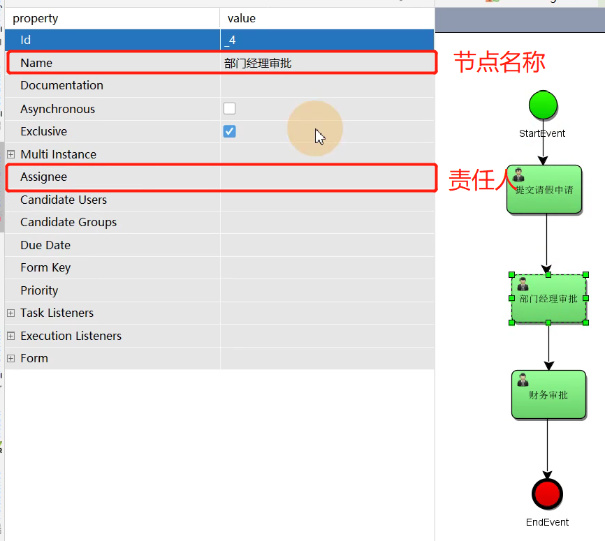

[TOC]

# 依赖

```xml
<dependency>
	<groupId>org.activiti</groupId>
	<artifactId>activiti-engine</artifactId>
	<version>${activity.version}</version>
</dependency>
<dependency>
	<groupId>org.activiti</groupId>
	<artifactId>activiti-spring</artifactId>
	<version>${activity.version}</version>
</dependency>
<!-- BPMN 模型处理 -->
<dependency>
	<groupId>org.activiti</groupId>
	<artifactId>activiti-bpmn-model</artifactId>
	<version>${activity.version}</version>
</dependency>
<!-- BPMN 转换 -->
<dependency>
	<groupId>org.activiti</groupId>
	<artifactId>activiti-bpmn-converter</artifactId>
	<version>${activity.version}</version>
</dependency>
<!-- BPMN json数据转换 -->
<dependency>
	<groupId>org.activiti</groupId>
	<artifactId>activiti-json-converter</artifactId>
	<version>${activity.version}</version>
</dependency>
<!-- BPMN 布局 -->
<dependency>
	<groupId>org.activiti</groupId>
	<artifactId>activiti-bpmn-layout</artifactId>
	<version>${activity.version}</version>
</dependency>
```

# Activiti配置文件

resources目录下创建配置文件，文件名`activiti.cfg.xml`

```xml
<beans xmlns="http://www.springframework.org/schema/beans"
       xmlns:xsi="http://www.w3.org/2001/XMLSchema-instance"
       xsi:schemaLocation="http://www.springframework.org/schema/beans   http://www.springframework.org/schema/beans/spring-beans.xsd">

    <bean id="processEngineConfiguration" class="org.activiti.engine.impl.cfg.StandaloneProcessEngineConfiguration">

        <property name="jdbcUrl" value="jdbc:mysql://localhost:3306/activiti?autoReconnect=true" />
        <property name="jdbcDriver" value="com.mysql.cj.jdbc.Driver" />
        <property name="jdbcUsername" value="root" />
        <property name="jdbcPassword" value="123456" />

        <!-- activiti数据库表处理策略 -->
        <property name="databaseSchemaUpdate" value="true" />
        <property name="asyncExecutorActivate" value="false" />
        <property name="mailServerHost" value="mail.my-corp.com" />
        <property name="mailServerPort" value="5025" />
    </bean>

</beans>
```

# 数据库表

数据库表无需自己手动创建，可以建立一个测试类如下，启动后即可自动创建数据库表

```java
public class TestCreateTable {

    @Test
    void createTable() {
        ProcessEngine engine = ProcessEngines.getDefaultProcessEngine();
        System.out.println(engine);
    }
}
```

执行后可到数据库中查看，创建的新库名称为activiti，表名为act_xxx_yyy，其中xxx代表其不同的归属域，其中：

- re-repository，与流程定义有关
- ru-runtime，运行过程中产生的数据在其中
- hi-history，所有的历史信息
- ge-general，通用信息，包含审批附件等内容

# 核心服务

- HistoryService
- RepositoryService
- RuntimeService
- TaskService - 管理任务

基本所有任务逻辑均需要围绕以上4个服务进行

`ManagementService`主要是对activiti进行管理和维护，与业务逻辑没有很强的关联性，与运维更贴合

# 基本配置内容

可在resources目录下创建bpmn流程文件，一般命名为xxx.bpmn或bpmn.xml（bpmn文件本质还是xml文件），安装插件后可以直接通过右击来创建bpmn文件，而无需自己手动创建和声明xml内容

可安装BPMN可视化插件进行流程的可视化配置，同时相关配置参数意义如下



创建结束后，可通过调用repositoryService来实现流程的部署，部署demo如下：

其中图片资源文件可以通过bpmn文件生成

## 创建流程

```java
@Test
void deployment() {
    ProcessEngine engine = ProcessEngines.getDefaultProcessEngine();
    RepositoryService repositoryService = engine.getRepositoryService();
    Deployment deployment = repositoryService.createDeployment()
            .addClasspathResource("Version.bpmn20.xml")
        	// png资源命名规范，需以.png|jpg|gif|svg
            .addClasspathResource("Version.png")
            .name("版本审核流程")
            .deploy();
    System.out.println("流程部署id: " + deployment.getId());
    System.out.println("流程部署名称： " + deployment.getName());
}
```

## 启动流程

```java
@Test
void startProcess() {
    // 创建ProcessEngine
    ProcessEngine engine = ProcessEngines.getDefaultProcessEngine();
    // 获取RuntimeService
    RuntimeService runtimeService = engine.getRuntimeService();
    // 根据流程定义ID启动流程
    ProcessInstance processInstance = runtimeService.startProcessInstanceByKey("Version");

    System.out.println("流程定义id: " + processInstance.getProcessDefinitionId());
    System.out.println("流程实例id: " + processInstance.getId());
    System.out.println("当前活动id: " + processInstance.getActivityId());
}
```

## 查询当前任务

```java
@Test
void findPersonalTaskList() {
    // 任务负责人
    String assignee = "user";
    ProcessEngine engine = ProcessEngines.getDefaultProcessEngine();
    // 获取taskService
    TaskService taskService = engine.getTaskService();
    // 根据流程Key 和 任务负责人查询任务
    List<Task> taskList = taskService.createTaskQuery()
            .processDefinitionKey("Version")
            .taskAssignee(assignee)
            .list();
    for (Task task: taskList) {
        System.out.println("流程实例id: " + task.getProcessDefinitionId());
        System.out.println("任务id: " + task.getId());
        System.out.println("任务负责人: " + task.getAssignee());
        System.out.println("任务名称: " + task.getName());
    }
}
```

## 提交（完成）任务

```java
@Test
void completeTask() {
    // 获取引擎
    ProcessEngine engine = ProcessEngines.getDefaultProcessEngine();
    // 获取taskService
    TaskService taskService = engine.getTaskService();
    // 根据流程key 和 任务的负责人 查询任务
    // 返回一个任务对象
    Task task = taskService.createTaskQuery()
            .processDefinitionKey("Version") // 流程key
            .taskAssignee("user") // 要查询的负责人
            .singleResult(); // 这个方法使用前提是要保证只能有一条任务，否则会抛出异常
    // 完成任务，参数：任务id
    taskService.complete(task.getId());
}
```

提交该任务后，可再去查询当前人员任务，任务消失，任务流转到下一级

## 查询流程定义

```java
@Test
void queryProcessDefinition() {
    // 获取引擎
    ProcessEngine engine = ProcessEngines.getDefaultProcessEngine();
    // 获取repositoryService
    RepositoryService repositoryService = engine.getRepositoryService();
    // 得到ProcessDefinitionQuery 对象
    ProcessDefinitionQuery processDefinitionQuery = repositoryService.createProcessDefinitionQuery();
    // 查询当前所有的流程定义
    // 条件： processDefinitionKey = evection
    // orderByProcessDefinitionVersion 按照版本排序
    // desc 倒序
    // list 返回集合
    List<ProcessDefinition> processDefinitions = processDefinitionQuery.processDefinitionKey("Version")
            .orderByProcessDefinitionVersion()
            .desc()
            .list();
    for (ProcessDefinition definition: processDefinitions) {
        System.out.println("流程定义 id: " + definition.getId());
        System.out.println("流程定义 name: " + definition.getName());
        System.out.println("流程定义 key: " + definition.getKey());
        System.out.println("流程定义 Version: " + definition.getVersion());
        System.out.println("流程部署ID: " + definition.getId());
    }
}
```

## 查询流程实例

```java
@Test
void queryProcessInstance() {
    // 流程定义key
    String processDefinitionKey = "Version";
    ProcessEngine engine = ProcessEngines.getDefaultProcessEngine();
    RuntimeService runtimeService = engine.getRuntimeService();
    List<ProcessInstance> list = runtimeService.createProcessInstanceQuery()
            .processDefinitionKey(processDefinitionKey)
            .list();
    for (ProcessInstance instance: list) {
        System.out.println("流程实例id: " + instance.getProcessInstanceId());
        System.out.println("所属流程定义id: " + instance.getProcessDefinitionId());
        System.out.println("是否执行完成: " + instance.isEnded());
        System.out.println("是否暂停: " + instance.isSuspended());
        System.out.println("当前活动标识: " + instance.getActivityId());
        System.out.println("业务关键字: " + instance.getBusinessKey());
    }
}
```

## 删除流程

```java
@Test
void deleteDeployment() {
    // 流程部署id
    String deploymentId = "1";
    ProcessEngine engine = ProcessEngines.getDefaultProcessEngine();
    RepositoryService repositoryService = engine.getRepositoryService();
    // 删除流程定义，如果该流程定义已有流程实例启动，则删除时报错
    repositoryService.deleteDeployment(deploymentId);
    // 设置true，级联删除流程定义，即使该流程有流程实例启动也可以删除，设置为false非级联删除方式
    // repositoryService.deleteDeployment(deploymentId, true);
}
```

## 查询流程定义

```java
@Test
void queryBpmnFile() throws IOException {
    ProcessEngine engine = ProcessEngines.getDefaultProcessEngine();
    RepositoryService repositoryService = engine.getRepositoryService();
    // 设置查询条件，查询流程定义
    ProcessDefinition definition = repositoryService.createProcessDefinitionQuery()
            .processDefinitionKey("Version")
            .list()
            .get(0);
    // 通过流程定义，获取部署id
    String deploymentId = definition.getDeploymentId();
    // 读取图片信息和BPMN信息
    InputStream pngInput = repositoryService.getResourceAsStream(deploymentId, definition.getDiagramResourceName());
    InputStream bpmnInput = repositoryService.getResourceAsStream(deploymentId, definition.getResourceName());
    File filePng = new File("D:/Version.png");
    File bpmnFile = new File("D:/Version.bpmn");
    FileOutputStream pngOut = new FileOutputStream(filePng);
    FileOutputStream bpmnOut = new FileOutputStream(bpmnFile);
    // 输出输出流的转换
    IOUtils.copy(pngInput, pngOut);
    IOUtils.copy(bpmnInput, bpmnOut);
    pngOut.close();
    bpmnOut.close();
}
```

## 查看历史信息

```java
@Test
void queryHistoryInfo() {
    ProcessEngine engine = ProcessEngines.getDefaultProcessEngine();
    HistoryService historyService = engine.getHistoryService();
    // 获取 actinst 表的查询对象
    HistoricActivityInstanceQuery instanceQuery = historyService.createHistoricActivityInstanceQuery();
    // 查询 actinst表，根据 InstanceId 查询，查询一个流程的所有历史信息
    // instanceQuery.processDefinitionId("id") - 根据 denifinitionId
    List<HistoricActivityInstance> instanceList = instanceQuery.processInstanceId("7501")
            // 增加排序操作，根据开始时间 ASC 排序
            .orderByHistoricActivityInstanceStartTime().asc()
            // 查询所有内容
            .list();
    for (HistoricActivityInstance instance: instanceList) {
        System.out.println(instance.getActivityId());
        System.out.println(instance.getActivityName());
        System.out.println(instance.getProcessDefinitionId());
        System.out.println(instance.getProcessInstanceId());
    }
}
```

# Activiti进阶

## 流程定义与流程实例

流程定义`ProcessDefinition`和流程实例`ProcessInstance`是`Activiti`中两个非常重要的概念，类似于类与对象的关系

流程定义`ProcessDefinition`是以BPMN文件定义的一个工作流程，是一组工作规范，流程实例`ProfcessInstance`则是一个具体的业务流程。例如某个员工发起一次请假，就会实例化一个请假的流程实例，并且不同的流程实例之间是互不影响的。

在后台数据库表结构中，流程定义的字段通常是PROC_DEF_ID，而流程实例的字段通常是PORC_INST_ID

### 启动流程实例时，添加Businesskey

启动一个流程实例的关键代码就是如下：

```java
ProcessInstance instance = runtimeService.startProcessInstanceByKey("Version");
```

`startProcessInstanceByKey`这个方法有多个重载的实现，可以传一些不同的参数，其中几个重要的参数包含：

- `String processDefinitionKey`： 流程定义的唯一键，不能为空
- `String bussinessKey`: 每个线程实例上下文中关联的唯一键
- `Map<String, Object> variables`: 在线程实例中传递的流程变量。这个流程变量可以在整个流程实例中使用
- `String tenantId`: 租户Id，这是Activiti的多租户设计，相当于每个租户可以上来获取一个相对独立的运行环境

```java
@Test
void addBusinessKey() {
    ProcessEngine engine = ProcessEngines.getDefaultProcessEngine();
    RuntimeService runtimeService = engine.getRuntimeService();
    // 启动流程过程中，添加businessKey
    // 第一个参数： 流程定义的Key
    // 第二个参数： businessKey，业务id，ex: 出差申请单的id
    // tips: businessKey存在长度限制，数据库限制长度为255
    ProcessInstance instance = runtimeService.startProcessInstanceByKey("Version", "1001");
    System.out.println("businessKey = " + instance.getBusinessKey());
}
```

> Tips: 需要注意的是，businessKey字段存在长度限制，长度为255，因此不建议直接在此存放business内容

### 挂起、激活实例

有时业务只是需要暂时停止一个流程，过一段时间后再恢复，例如月底不接受报销审批流程，年底不接受借贷审批流程等，这个时候就可以将流程进行挂起操作，挂起后的流程就不会再继续执行

在挂起时，有两种操作方式

一种时将整个流程定义ProcessDefinition挂起，这样这个流程定义下的所有流程实例都将挂起，无法继续执行

```java
@Test
void suspendAllProcessInstance() {
    ProcessEngine engine = ProcessEngines.getDefaultProcessEngine();
    RepositoryService repositoryService = engine.getRepositoryService();
    ProcessDefinition definition = repositoryService.createProcessDefinitionQuery()
            .processDefinitionKey("Version")
            .list().get(0);
    boolean suspended = definition.isSuspended();
    String id = definition.getId();
    if (suspended) {
        // 参数1： 流程定义id 参数2： 是否激活 参数3： 激活时间
        repositoryService.activateProcessDefinitionById(id, true, null);
        System.out.println("流程定义id: " + id + " 已激活");
    } else {
        // 参数1： 流程定义id 参数2： 是否挂起 参数3： 激活时间
        repositoryService.suspendProcessDefinitionById(id, true, null);
        System.out.println("流程定义id: " + id + " 已挂起");
    }
}
```

