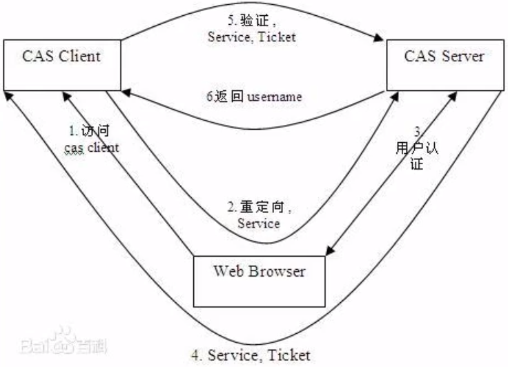
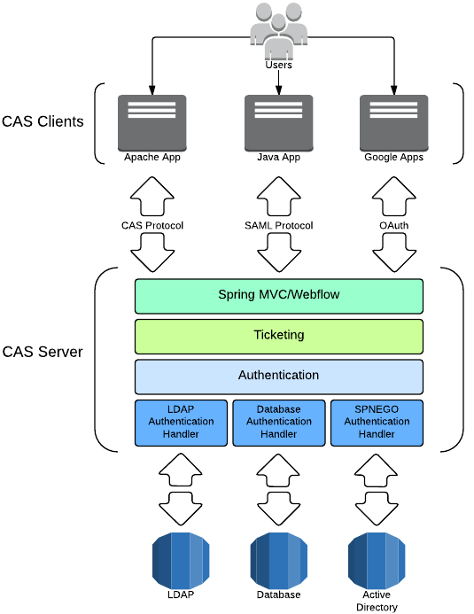

[TOC]

# 简介

CAS(Central Authentication Service，中央认证服务)，一种独立的开放指令协议，是耶鲁大学发起的一个开源项目，旨在为 Web 应用系统提供一种可靠的单点登录方法

特点：

- 开源的企业级单点登录解决方案
- CAS Server 为需要独立部署的 Web 应用
- CAS Client 支持非常多的客户端，包括 Java/.Net/Php/Perl/Apache/uPortal/Ruby等
- CAS 属于Apache 2.0许可证，允许代码修改再发布

从结构上看，CAS 包含两个部分：CAS Server 和 CAS Client。CAS Server 需要独立部署，主要负责对用户的认证工作；CAS Client 负责处理对客户端受保护资源的访问请求，需要登录时，重定向到CAS Server。下图是 CAS 最基本的协议过程：



CAS Client 与受保护的客户端应用部署在一起，以 Filter 方式保护受保护的资源。对于访问受保护资源的每个 Web 请求，CAS Client 会分析该请求的 Http 请求中是否包含 Service Ticket，如果没有，则说明当前用户尚未登陆，于是讲请求重定向到制定好的 CAS Server 登陆地址，并传递 Service （也就是要访问的目标资源地址），以便登录成功后转回该地址。用户在第3步中输入认证信息，如果登录成功，CAS Server 随机产生过一个相当长度、唯一、不可伪造的 Service Ticket，并缓存以待将来验证，之后系统自动重定向到 Service 所在地址，并为客户端浏览器设置一个 Ticket Granted Cookie(TGC), CAS Client 在拿到 Service 和新的 Ticket 过后，在第5、6步中与 CAS Server 进行身份核实，以确保 Service Ticket 的合法性

在该协议中，所有与 CAS 的交互均采用 SSL 协议，确保 ST 和 TGC 的安全性，协议工作过程中会有两次重定向过程，但是 CAS Client 和 CAS Server 之间进行 Ticket 验证的过程对于用户是透明的

# 步骤

## 搭建 Tomcat Https 协议支持

CAS 采用 Https 协议处理用户请求，所以我们需要配置 Tomcat 支持 Https 协议

1. 生成密钥库

    使用 JDK 自带的 keytool 工具生成密钥库

    ```shell
    keytool -genkey -v -alias keyname -keyalg RSA -keystore D:\cas\keystore\keyname.keystore
    ```

    > Tips：
    >
    > `-genkey` 生成密钥对，同 `-genkeypair`
    >
    > `-v ` 详细输出
    >
    > `-alias` 要处理的条目的别名
    >
    > `-keyalg` 密钥所使用的加密算法
    >
    > `-keystore` 密钥存储位置

    注：生成密钥库时需要填写相关信息，其中姓名、组织单位、组织名称建议写作域名（影响未知）

    同时最后需要设置密钥库密码，请牢记该密码。设置完成后，会在指定路径下生成一个密钥库文件

2. 从密钥库中导出证书

    ```shell
    keytool -export -trustcacerts -alias keyname -file D:\cas\keystore\keyname.cer -keystore D:\cas\keystore\keyname.keystore
    ```

    > Tips：
    >
    > `-export` 导出证书
    >
    > `-trustcacerts` 信任来自 cacerts 的证书
    >
    > `-file` 输出文件名
    >
    > `-keystore` 密钥库名称

    即可在指定路径下生成相应证书文件

3. 将证书导入到 JDK 证书库

    ```shell
    keytool -import -trustcacerts -alias keyname -file D:\cas\keystore\keyname.cer -keystore 'D:\Program Files\Java\Jdk\Jre\lib\security\cacerts'
    ```

    > Tips：
    >
    > `-import` 导入证书或证书链

    注：此时导入 JDK 证书库密码非自己设置的密钥库密码，JDK 证书库密码为：**changeit**

4. Tomcat 配置 Https 支持

    在 Tomcat 配置文件 /conf/server.xml 中，加入如下配置

    ```xml
    <Connector port="8443" protocol="org.apache.coyote.http11.Http11NioProtocol" 
               maxThreads="150" SSLEnabled="true" scheme="https" secure="true"
               clientAuth="false" sslProtocol="TLS"
               keystoreFile="D:\cas\keystore\keyname.keystore"
               keystorePass="password"/>
    ```

## CAS Server 搭建

### CAS Server 下载

官方地址：https://www.apereo.org/projects/cas

github地址：

- https://github.com/apereo/cas，源码，版本齐全，需要自己打包

    CAS  服务端地址：https://github.com/apereo/cas-overlay-template

- https://repo1.maven.org/maven2/cas/，可直接下载 war 包

> Tips：
>
> 注意 CAS Server 版本，CAS 6.3.x 最低支持 JDK 11以上，CAS 5.x.x 支持 JDK 1.8

CAS 架构：



### CAS 发布到 Tomcat

CAS war 包发布至 Tomcat，进行如下配置：

- 修改`apache-tomcat-8.5.43\webapps\cas\WEB-INF\classes`下`application.properties`文件

    - 增加（默认 https，设置兼容 http）

        ```properties
        cas.tgc.secure=false
        cas.serviceRegistry.initFromJson=true
        ```

    - 修改端口，调整至与 Tomcat 一致

        ```properties
        server.port=8080
        ```

    - 调整测试账户（可选）

        ```properties
        cas.authn.accept.users=admin::admin
        ```

- 修改 `webapps\cas\WEB-INF\classes\services` 下 `HTTPSandIMAPS-10000001.json` 文件

    ```json
    "serviceId" : "^(https|http|imaps)://.*",
    ```

登录测试页即可验证部署情况：http://localhost:8080/cas/login

### 接入数据源

修改配置文件，配置文件位置：`\apache-tomcat-8.5.81\webapps\cas\WEB-INF\classes\application.properties`，将上述测试账户注释删除，添加下述字段接入数据源

```properties
cas.authn.jdbc.query[0].url=jdbc:mysql://localhost:3306/testdb?serverTimezone=GMT
cas.authn.jdbc.query[0].user=root
cas.authn.jdbc.query[0].password=123456
cas.authn.jdbc.query[0].sql=SELECT * FROM table WHERE username=?
cas.authn.jdbc.query[0].fieldPassword=password # 密码字段，会与用户输入相匹配
cas.authn.jdbc.query[0].driverClass=com.mysql.cj.jdbc.Driver
```

完成上述配置后，向 CAS 服务端中添加相关依赖包（位置：cas\WEB-INF\lib）

- mysql-connector-java.jar
- cas-server-support-jdbc.jar
- cas-server-support-jdbc-authentication.jar
- cas-server-support-jdbc-drivers.jar

> Tips：
>
> 如设置外部数据源后项目无法启动或出现登录页 404 问题，可能是缺少相关依赖包导致，请仔细仔细仔细仔细审查 Tomcat 发布日志以及下载项目源码定位问题

# CAS 客户端搭建

## 相关依赖

```xml
<!-- CAS 客户端 -->
<dependency>
    <groupId>net.unicon.cas</groupId>
    <artifactId>cas-client-autoconfig-support</artifactId>
    <version>${cas.version}</version>
</dependency>
```

## 相关配置

修改客户端配置文件 application.properties 或 application.yml

```properties
cas.server-url-prefix=http://localhsot:8080/cas # CAS 服务端地址
cas.server-login-url=http://localhost:8080/cas/login # CAS 登陆地址
cas.client-host-url=http://localhost:18080 # 登录成功回调地址
cas.use-session=true
cas.validation-type=cas3 # 类型，cas2已淘汰

server.port=18080 # 修改客户端接口，防止与本地服务端端口冲突
```

## 启用 CAS 客户端

在 SpringBoot 启动文件添加注解 `@EnableCasClient` 以启用 CAS 客户端

```java
@SpringBootApplication
@EnableCasClient
public class SpringBootTestApplication {
    public static void main(String[] args) {
        SpringApplication.run(SpringBootTestApplication.class, args);
    }
}
```

若部署成功，此时访问 CAS 客户端接口会被拦截

> Tips：
>
> 本地环境测试时，务必要在 `C:\Windows\System32\drivers\etc\host` 文件中为服务端与客户端设置不同的域名映射，如：
>
> ```txt
> 127.0.0.1 casservice.com
> 127.0.0.1 casclient.com
> ```
>
> 如不设置可能会导致404错误

登录系统后可以通过 `session._const_cas-assertin_.principal.name` 获取登录用户名

## 注销

基本思路：通过注销，将访问转发至 CAS 服务端的注销接口，实现服务的统一注销，CAS 服务端注销接口为：http://casservice.com:8080/cas/logout

> Tips：
>
> https://caservice.com 为自己在 host 文件中做的服务端地址映射，使用时需要自行调整，即：http(s)://host:port/cas/logout

```java
@RequestMapping("/logout")
public String logout() {
    reuturn "redirect:https://casservice.com:8080/cas/logout";
}
```

# 界面修改

相关页面在 `apache-tomcat-8.5.81\webapps\cas\WEB-INF\classes\templates`下，包含登录、注销及其他页面，重点关注三个文件 `layout.html`、`casLoginView.html`及`casLogoutView.html`
