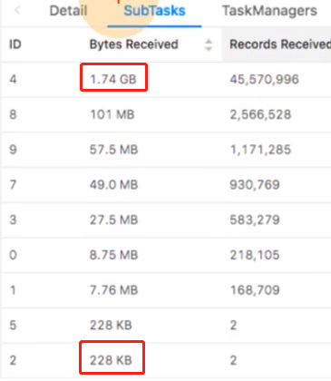
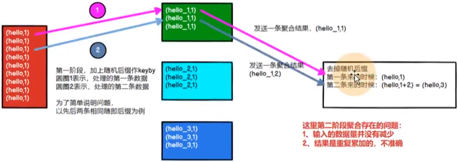
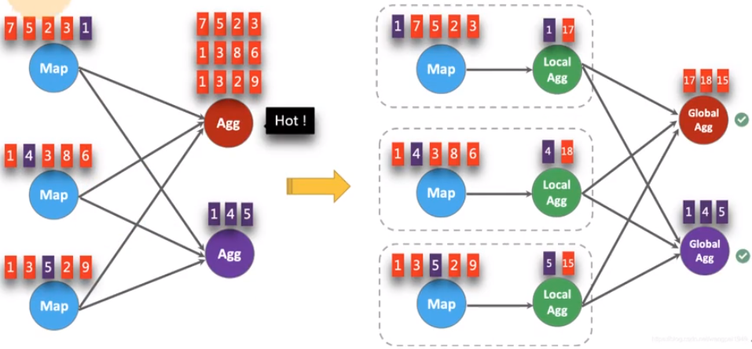
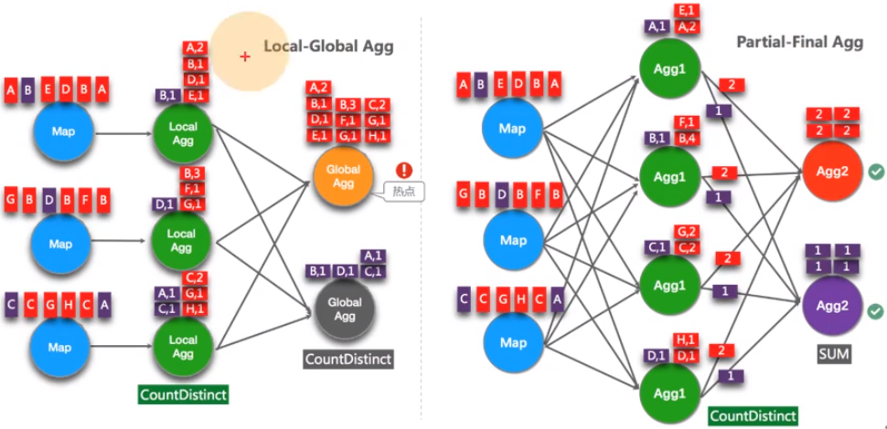
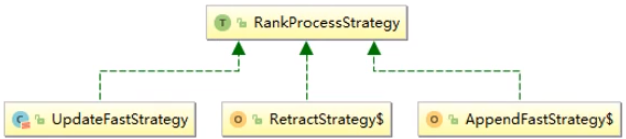

[TOC]

# 一. 资源配置调优

## 1. 内存设置

- `jobmanager.memory.process.size`设置 `JobManager`内存大小，`JobManager`负责资源调度，一般不用设置太大，建议设置范围 2-4 G
- `taskmanager.memory.process.size`设置单个`TaskManager`内存大小，`TaskManager`负责计算，建议设置范围 2-8 G，可根据每秒钟数据量自行调整
- `taskmanager.numberOfTaskSlots`设置每个核容器中`slot`数量，一般为一拖一或一拖二，即一个核负责一个`slot`计算或两个`slot`，对于简单的数据处理，为了提高资源利用率，可以使用一拖二

## 2. 并行度设置

### 2.1 最优并行度计算

要先进行压力测试，任务并行度设定10以下，测试单个并行度的处理上限。然后$总QPS÷单并行度的处理能力=并行度$（QPS-每秒钟的查询两，TPS-每秒钟请求量）

不能只从QPS得出并行度，有些字段少、逻辑简单的任务，单并行度每秒可以处理上万条数据。而对于数据字段多，处理逻辑复杂，单并行度每秒只能处理1000条数据。最好根据高峰期的QPS压测，并行度 × 1.2，富裕部分资源

### 2.2 Source端并行度的设置

数据源端是 Kafka，Source 的并行度设置为 Kafka 对应 Topic 的分区数

如果已经等于 Kafka 的分区数，消费速度仍跟不上数据生产速度，考虑 Kafka 扩大分区同时调大并行度等于分区数

Flink 的一个并行度可以处理一至多个分区的数据，如果并行度多于 Kafka 的分区数，就会造成并行度空闲，浪费资源

### 2.3 Transform 端并行度的配置

- KeyBy 之前的算子

    一般不会做过重的计算工作，都是诸如map、filter、flatmap等处理较快的算子，并行度可以和 source 保持一致

- KeyBy 之后的算子

    如果并发量较大，建议设置并行度为2的整数次幂，例如：128、256、512；

    小并发的任务不一定需要设置成2的整数次幂；

    大并发任务如果没有 KeyBy，并行度也无需设置成2的整数次幂

### 2.4 Sink 端并行度的设置

Sink 端是数据流向下游的地方，可以根据 Sink 端的数据量及下游的服务抗压能力进行评估。如果 Sink 端是 Kafka，可以设置为 Kafka 对应的 Topic 的分区数

Sink 端的数据量小，比较常见的就是监控告警的场景，并行度可以设置的小一些

Source 端的数据量是最小的，拿到 Source 端流过来的数据后做了细粒度的拆分，数据量不断的增加，到 Sink 端的数据量就非常大。那么在 Sink 到下游的存储中间件的时候就需要提高并行度

Sink 端要与下游的服务进行交互，并行度还得根据下游的服务抗压能力来设置，如果在 Flink Sink 这端的数据量过大的话，且 Sink 处设置的并行度也设置的很大，但下游的服务完全撑不住这么大的并发写入，可能就会造成下游服务直接被写挂，所以最终还要在 Sink 处的并行度做一定的权衡

如果 Sink 到 Mysql 中，可以考虑批处理，尽量减少与数据库的交互

## 3. RocksDB 大状态调优

> 状态后端核心工作就是存取状态以及状态备份 checkpoint，状态后端可以分为三类：
>
> 1. 内存：内存后端的本地状态存储在 TaskManager 内存中，状态备份 checkpoint 存储在 JobManager 内存中
> 2. 文件系统（FileSystem, FS）：基于文件系统的状态后的本地状态同样存储在 TaskManager 内存中，状态备份 checkpoint 存储在文件系统中
> 3. RocksDB：本地状态存储在 RocksDB 中，状态备份 checkpoint 存储在文件系统中
>
> RocksDB 可能会碰到的问题：OOM、容器被 kill(OOM: 超过 TaskManager 指定的内存)
>
> 解决思路：1. 调大内存；2. 加快刷写

RocksDB 是基于 LSM Tree 实现的（类似于 HBase），写数据都是先缓存到内存中，所以 RocksDB 的写请求效率比较高。RocksDB 使用内存结合磁盘的方式来存储数据，每次获取数据时，先从内存中 blockcache 中查找，如果内存中没有再去磁盘中查询。优化后差不多单并行度 TPS 5000 records/s，性能瓶颈主要在于 RocksDB 对磁盘的读请求，所以当性能处理不够时，仅需要横向扩展并行度即可提高整个 Job 的吞吐量

- 设置 RocksDB 多目录

    在 `flink-conf.yaml` 中配置（多目录一般指多次盘）

    ```yaml
    state.backend.rocksdb.localdir: /data1/flink/rocksdb,/data2/flink/rocksdb,/data3/flink/rocksdb
    ```

    注意：不要配置单块磁盘的多个目录，务必将目录配置到多块不同的磁盘上，让多块磁盘来分担压力。当设置多个 RocksDB 本地磁盘目录时，Flink 会随机选择要使用的目录，所以就可能存在三个并行度共同使用同一目录的情况。如果服务器磁盘书较多，一般不会出现该情况，但是如果任务重启后吞吐量较低，可以检查是否发生了多个并行度公用同一块磁盘的情况

    当一个 TaskManager 包含3个 slot 时，那么单个服务器上的三个并行度都对磁盘造成频繁读写，从而导致三个并行度之间互相争抢同一个磁盘的IO，务必导致三个并行度的吞吐量都会下降，设置多目录实现三个并行度使用不用的硬盘从而减少资源竞争

- `state.backend.incremental`：开启增量检查点，默认 false，改为 true。每次只提交增量内容，减少IO开支

- `state.backend.rocksdb.predefined-options`：`SPINNING_DISK_OPTIMIZED_HIGH_MEM`设置为机械硬盘+内存格式，如有条件使用 SSD，则可将其指定为`FLASH_SSD_OPTIMIZED`

- `state.backend.rocksdb.block.cache-size`：整个 RocksDB 共享一个block cache，读数据时内存的 cache 大小，该参数越大读数据时缓存命中率越高，默认为8MB，建议设置64-256MB

- `state.backend.rocksdb.thread.num`：用于后台 flush 和合并 sst 文件的线程数，默认为1，建议调大，机械硬盘用户可以改为4等更大值

- `state.backend.rocksdb.writebuffer.size`：RocksDB 中，每个 State 使用一个 Column Family，每个 Column Family 使用独占的write buffer，建议调大，例如：32M

- `state.backend.rocksdb.writebuffer.size`：每个 Column Family 对应的 write buffer 数目，默认值是2，对于机械磁盘来说，如果内存足够大，可以调大到5左右

- `state.backend.rocksdb.writebuffer.number-to-merge`：将数据从 write buffer 中刷写到磁盘时，需要合并的 write buffer 数量，默认值是1，可以调成3

- `state.backend.local-rocovery`：设置本地恢复，当 Flink 任务失败时，可以基于本地的状态信息进行恢复任务，可能不需要从 HDFS 拉去数据

## 4. Checkpoint 设置

一般我们的 Checkpoint 时间间隔可以设置为分钟级别，例如1分钟、3分钟，对于状态很大的任务每次 Checkpoint 访问 HDFS 比较好耗时，可以设置为 5~10 分钟一次 Checkpoint，并且调大两次 Checkpoint 之间的暂停间隔，例如设置两次 Checkpoint 之间至少暂停 4 或 8 分钟

如果 Checkpoint 语义配置为 EXACTLY_ONCE，那么 Checkpoint 过程还会存在 barrier 对齐的过程，可以通过 Flink Web UI 的 Checkpoint 选项卡来查看 Checkpoint 过程中各阶段的耗时情况，从而确定到底是哪个阶段导致 Checkpoint 时间过长然后针对性的解决问题

```java
// 使用RocksDBStateBackend 作为状态后端，并开启增量 Checkpoint
RocksDBStateBackend rocksDBStateBackend = new RocksDBStateBackend("hdfs://hadoop1:8020/flink/checkpoint", true);
environment.setStateBackend(rocksDBStateBackend);

environment.enableCheckpointing(3 * 60 * 1000); // 3分钟一个检查点
// 配置 Checkpoint
CheckpointConfig checkpointConfig = environment.getCheckpointConfig();
checkpointConfig.setCheckpointingMode(CheckpointingMode.EXACTLY_ONCE);
// 最小间隔4分钟
checkpointConfig.setMinPauseBetweenCheckpoints(4 * 60 * 1000);
// 超时时间10分钟
checkpointConfig.setCheckpointTimeout(10 * 60 * 1000);
// 保存Checkpoint
checkpointConfig.enableExternalizedCheckpoints(CheckpointConfig.ExternalizedCheckpointCleanup.RETAIN_ON_CANCELLATION);
```

# 二. 反压处理

反压（BackPressure）通常产生于这样的场景：短时间的负载高峰导致系统接收数据的速率远高于它数据处理的速率。许多日常问题都会导致反压，例如，垃圾回收停顿可能会导致流入的数据快速堆积，或遇到大促、秒杀活动导致流量陡增。反压如果不能得到正确的处理，可能会导致资源耗尽甚至系统崩溃

反压机制是指系统能够自己检测到被阻塞的算子，然后自适应地降低源头或上有数据的发送速率，从而维持整个系统的稳定。Flink任务一般运行在多个节点上，数据从上游算子发送到下游算子需要网络传输，若系统在反压时想要降低数据源头或上游算子数据的发送速率，肯定也需要网络传输。所以先了解一下 Flink 的网络流控（Flink 对网络数据流量的控制）机制

## 1. 反压现象及定位

Flink 的反压太过天然，导致无法简单的通过监控 BufferPool 的使用情况来判断反压状态。Flink 通过对运行中的任务进行采样来确定其反压，如果一个 Task 因为反压导致其处理速度降低了，那么它肯定会卡在向 LocalBufferPool 申请内存块上。那么该 Task 的 stack trace 应该是这样：

> java.lang.Object.wait(Native Method)
> o.a.f[...].LocalBufferPool.requestBuffer(LocalBufferpool.java: 163)
>
> o.a.f[...].LocalBufferPool.requestBufferBlocking(LocalBufferpool.java: 163)[...]

监控对正常的任务运行有一定的影响，因此只有当 Web 页面切换到 Job 的 BackPressure 页面时，JobManager 才会对该 Job 触发反压监控。默认情况下，JobManager 会触发 100 次 stack trace 采样，每次间隔 50ms 来确定反压。Web 界面看到的比率表示在内部方法调用中有多少 stack trace 被卡在 LocalBufferPool.requestBlocking()。例如：0.01 表示在 100 个采样中只有 1 个被卡在 LocalBufferPool.requestBufferBlocking)采样得到的比例与反压状态的对应关系如下

| 状态 |        范围         |
| :--: | :-----------------: |
|  OK  | $0\le rate \le 0.1$ |
| LOW  |   $0<rate\le0.5$    |
| HIGH |   $0.5<rate\le1$    |

Task 的状态为 OK 表示没有反压，HIGH 表示这个 TASK 被反压

<font color=red>排查时，要先把 operation chain 禁用以方便定位</font>

如何定位反压？

1. 断开全局算子链 operation chain
2. Web UI  BackPressure 页面查看状态
3. Metric指标：①是否反压`isBackPressured` ②输入缓冲区利用率`Shuffle.Netty.Input.Buffers.inPoolUsage`

## 2. 反压的原因及处理

先检查基本原因，然后再深入研究更复杂的原因，最后找出导致瓶颈的原因。下面列出从最基本到比较复杂的一些反压潜在原因

注意：反压可能是暂时的，可能是由于负载高峰、Checkpoint 或作业重启引起的数据积压而导致反压。如果反压是暂时的，应该忽略它。另外，断断续续的反压会影响分析和解决问题。

### 2.1 系统资源

检查设计服务器基本资源的使用情况，如 CPU、网络或磁盘I/O，目前 Flink 任务使用最主要的还是内存和 CPU 资源，本地磁盘、依赖的外部存储资源以及网卡资源一般都不会是瓶颈。如果某些资源被充分利用或大量利用，可以借助分析工具，分析性能瓶颈（JVM Profiler + FlameGraph 生成火焰图)

如何生成火焰图（http://www.54tianzhisheng.cn/2020/10/05/flink-jvm-profiler/#%E4%B8%8B%E8%BD%BD-FlameGraph）

如何读懂火焰图（https://zhuanlan.zhihu.com/p/29952444）

- 针对特定的资源调优 Flink
- 通过增加并行度或增加集群中的服务器数量来横向扩展
- 减少瓶颈算子上游的并行度，从而减少瓶颈算子接受的数据量（不建议，因为可能会导致整个 Job 数据延迟增大）

### 2.2 垃圾回收（GC）

长时间 GC 暂停会导致性能问题，可以通过打印调试 GC 日志（通过 -Xx:+PrintGCDetail）或使用某些内存或 GC 分析器（GCViewer 工具）来验证是否处于这种情况

- 在 Flink 提交脚本中，设置 JVM 参数，打印 GC 日志：

    ```
    bin/flink run \
    -t yarn-per-job \
    -d \
    -p 5 \ 指定并行度
    -Dyarn.application.queue=test \指定yarn队列
    -Djobmanager.memory.process.size=1024mb \ 指定JM的总进程大小
    -Dtaskmanager.memory.process.size=1024mb \ 指定每个TM的总进程大小
    -Dtaskmanager.numberOfTaskSlots=2 \指定每个TM的slot
    -Denv.java.opts="-XX:+PrintGCDetails -XX:+PrintGCDateStamps"
    -c com.example.flink.jar
    ```

- 下载 GC 日志的方式

    可以在 Web UI 的Job Manager 或 Task Manager 的 Stdout 中查看和下载 GC 日志

- 分析 GC 日志

    通过 GC 日志分析出单个 Flink TaskManager 堆总大小、年轻代、老年代分配的内空间、Full GC 后老年代剩余大小等，相关指标定义可以去 Github 中查看。GC Viewer 地址：https://github.com/chewiebug/GCViewer

    最重要的指标是 <font color=red>Full GC 后，老年代剩余大小</font>这个指标，按照《Java 性能优化权威指南》这本书 Java 堆大小计算法则，设 Full GC 后老年代剩余大小空间为 M，那么堆的大小建议 3~4 倍M，新生代为 1~1.5 倍M，老年代应为 2~3倍 M

### 2.3 CPU/线程瓶颈

有时，一个或几个线程导致 CPU 瓶颈，而整个机器的 CPU 使用率仍然较低，则可能无法看到 CPU 瓶颈。例如：48核的服务器上，单个 CPU 的线程仅占用 2% 的 CPU 使用率，就算单个线程发生了 CPU 瓶颈，也无法观测出来，因此可以考虑使用火焰图来显式每个线程的 CPU 使用情况来识别热线程

### 2.4 线程竞争

与 CPU/线程瓶颈类似，subtask 可能会因为共享资源上高负载线程的竞争而成为瓶颈。同样可以使用火焰图，考虑在用户代码中查找同步开销、锁竞争，尽量避免在用户代码中添加同步

### 2.5 负载不平衡

如果数据是由数据倾斜造成，可以尝试通过将数据分区的 key 进行加盐或通过实现本地聚合来减轻数据倾斜的影响

### 2.6 外部依赖

如果 Source 端数据读取性能比较低或者 Sink 端写入性能较差，需要检查第三方组件是否遇到瓶颈。例如：Kafka 集群是否需要扩容，Kafka 连接器是否并行度较低，HBase 的 rowkey 是否遇到热点问题。关于第三方组件的性能问题，需要结合具体的组件来分析

# 三. 数据倾斜

## 1. 判断数据是否存在倾斜

相同 Task 的多个 Subtask 中，个别 Subtask 接收到的数据量明显大于其他 Subtask 接收到的数据量，通过 Flink Web UI 可以精确而看到每个 Subtask 处理了多少数据，即可判断 Flink 任务是否存在数据倾斜。通常，数据倾斜也会引起反压



## 2. 数据倾斜的解决

### 2.1 keyby 后的聚合操作存在数据倾斜

使用 LocalKeyBy 的思想：在 keyby 上游算子数据发送之前，首先在上游算子的本地对数据进行聚合后再发送到下游，使下游接收到的数据量大大减少，从而使得 keyby 之后的聚合操作不再是任务的瓶颈。类似 MapReduce 中 Combiner 的思想，<font color=red>但是这要求聚合操作必须时多条数据或者一批数据才能聚合，单条数据没有方法通过聚合来减少数据量</font>。从Flink LocalKeyBy 实现原理来讲，必然会存在一个<font color=red>积攒批次</font>的过程，在上游算子中必须攒够一定的数据量，对这些数据聚合后再发送到下游

<font color=red>注意</font>：Flink 是实时流处理，如果 keyby 之后的聚合操作存在数据倾斜，且没有开窗口的情况下，简单的认为使用两阶段聚合是不能解决问题的。因为这个时候 Flink 是来一条处理一条，且向下游发送一条结果，对于原来 keyby 的维度（第二阶段聚合）来讲，数据量并没有减少，且结果重复计算（非 FlinkSQL，未使用回撤流），如下图所示：



- 实现方式：以计算 PV 为例，keyby 之前，使用 flatmap 实现 LocalKeyBy

    ```java
    class LocalKeyByFlatMap extends RichFlatMapFunction<String, Tuple2<String, Long> {
        // CheckPoint 时为了保证 Exactly Once，将 Buffer 中的数据保存到该 ListState 中
        private ListState<Tuple2<String, Long>> localPvStatListState;
    
        // 本地 buffer，存放 local 端缓存的 app 的 pv 信息
        private HashMap<String, Long> localPvStat;
    
        // 缓存的数据量大小，即：缓存多少数据再向下游发送
        private int batchSize;
    
        // 计数器，获取当前批次接受的数据量
        private AtomicInteger currentSize;
    
        // 构造器，批次大小传参
        LocalKeyByFaltMap(int batchSize) {
            this.batchSize = batchSize;
        }
        
        @Override
        pulic void flatMap(String in, Collector collector) throws Exception {
            // 将新来的数据添加到 buffer 中
            Long pv = localPvStat.getOrDefault(in, 0L);
            localPvStat.put(in, pv + 1);
            // 如果达到设定的批次，则将 buffer 中的数据发送到下游
            if (currentSize.incrementAndGet() >= batchSize) {
                // 遍历 buffer 中的数据，发送到下游
                for (Map.Entry<String, Long> appIdPv: localPvStat.entrySet()) {
                    collector.collect(Tuple2.of(appIdPv.getKey(), appIdPv.getValue()))
                }
                // Buffer 清空，计数器清零
                localPvStat.clear();
                currentSize.set(0);
            }
        }
        ......
    }
    ```


### 2.2 keyby 之前发生发生数据倾斜

如果 keyby 之前就存在数据倾斜，上游算子的某些实例可能处理的数据较多，某些实例可能处理的数据较少，产生该情况可能是因为数据源的本身就不均匀，例如由于某些原因 Kafka 的 topic 中某些 partition 的数据量较大，某些 partition 的数据量较少。对于不存在 keyby 的 Flink 任务也会出现该情况

这种情况需要让 Flink 任务强制进行 shuffle。使用 shuffle、rebalance或rescale算子即可将数据均匀分配，从而解决数据倾斜的问题

### 2.3 keyby 后的窗口聚合操作存在数据倾斜

因为使用了窗口，变成了有界数据的处理，窗口默认是触发时才会输出一条结果发往下游，所以可以使用两阶段聚合的方式：

实现思路：

- 第一阶段聚合：key 拼接随机数前缀或后缀，进行 keyby、开窗、聚合

    <font color=red>注意</font>：聚合完不再是 WindowedStream，要获取 WindowEnd 作为窗口标记作为第二阶段分组依据，避免不通窗口的结果聚合到一起

- 第二阶段聚合：去掉随机数前缀或尾缀，按照原来的 key 以及 WindowEnd 作 keyby、聚合

# 四. KafkaSource 调优

## 1. 动态发现分区

当 FlinkKafkaConsumer 初始化时，每个 subtask 会订阅一批 partition，但是当 Flink 任务运行过程中，如果被订阅的 topic 创建了新的 partition，FlinkKafkaConsumer 如何实现动态发现新创建的 partition 并消费呢？

在使用 FlinkKafkaConsumer 时，可以开启 partition 的动态发现，通过 Properties 指定参数开启（单位时毫秒）：

```
FlinkKafkaConsumerBase.KEY_PARTITION_DISCOVERY_INTERVAL_MILLIS
```

## 2. 从 Kafka 数据源生成 watermark

Kafka 单分区内有序，多份区间无序。在这种情况下，可以使用 Flink 中可识别 Kafka 分区的 watermark 生成机制。使用此特性，将在 Kafka 消费端内部针对每个 Kafka 分区生成 watermark，并且不同分区 watermark 的合并方式与在数据流 shuffle 时的合并方式相同

在单分区内有序的情况下，使用时间戳单调递增按分区生成的 watermark 将生成完美的全局 watermark

```java
Properties properties = new Properties();
String brokers = "10.100.113.3:9092,10.100.113.4:9092,10.100.113.5:9092";
properties.setProperty("bootstrap.servers", brokers);
properties.setProperty("auto.offset.reset", "latest");
properties.setProperty("group.id", "g6test");

FlinkKafkaConsumer<String> kafkaSourceFunction = new FlinkKafkaConsumer<> (
	"flinktest",
	new SimpleStringSchema(),
	properties
);
kafkaSourceFunction.assignTimestampsAndWatermarks(
	WatermarkStrategy
    	.forBoundedOutOfOrderness(Duration.ofMinutes(2)));

env.addSource(kafkaSourceFunction);
```

## 3. 设置空闲等待

如果数据源中的某一个分区/分片在一段时间内未发送事件数据，则意味着 WatermarkGenerator 也不会获得任何新数据去生成  watermark，我们称这类数据源为空闲输入或空闲源。在这种情况下，当某些分区仍然发送事件数据的时候就会出现问题，比如 Kafka 的 topic 中，由于某些原因造成个别 partition 一直没有新的数据。<font color=red>由于下游算子 watermark 的计算方式是取所有不同的上游并行数据源 watermark 的最小值，则其 watermark 将不会发生变化，导致窗口给、定时器等不会触发</font>

## 4. Kafka 的 offset 消费策略

FlinkKafkaConsumer 可以调用以下 API（注意与“auto.offset.reset”区分开）：

- `setStartFromGroupOffsets()`：<font color=red>默认消费策略</font>，默认读取上次保存的 offset 信息，如果是应用第一次启动，读取不到上次的 offset 信息，则会根据这个参数`auto.offset.reset`的值来进行消费数据，建议使用这个
- `setStartFromEarliest()`：从最早的数据开始消费，<font color=red>忽略存储的 offset 信息</font>
- `setStartFromLatest()`：从最新的数据开始消费，<font color=red>忽略存储的 offset 信息</font>
- `setStartFromSpecificOffsets(Map)`：从指定位置进行消费
- `setStartFromTimestamp(long)`：从 topic 中指定的时间点开始消费，指定时间点之前的数据忽略

当 checkpoint 机制开启的时候，KafkaConsumer 会定期把 Kafka 的 offset 信息还有其他 operator 的状态信息一块保存起来。当 job 失败重启时，Flink 会从最近一次的 checkpoint 中进行恢复数据，重新从保存的 offset 消费 Kafka 中的数据（<font color=red>也就是说，上面几种策略，只有第一次启动的时候起作用</font>）

为了能够使用支持容错的 Kafka Consumer，需要开启 checkpoint

# 五. FlinkSQL 调优

FlinkSQL 官网配置参数：https://nightlies.apache.org/flink/flink-docs-release-1.14/zh/docs/dev/table/config/

## 1. Group Aggregate 优化

### 1.1 开启 MiniBatch（提升吞吐）

MiniBatch 是微批处理，原理是<font color=red>缓存一定的数据后再触发处理，以减少对 State 的访问，从而提升吞吐并减少数据的输出量</font>。MiniBatch 主要依靠在每个 Task 上注册的 Timer 线程来触发微批，需要消耗一定的线程调度性能

- MiniBatch 默认关闭，开启方式如下：

    ```java
    // 初始化 table environment
    TableEnvironment tEnv = ...;
    // 获取 tabelEnv 的配置对象
    Configuration config = tEnv.getConfig().getConfiguration();
    
    // 设置参数
    // 开启 miniBatch
    configuration.setString("table.exec.mini-batch.enabled", "true");
    // 批量输出的间隔时间
    configuration.setString("table.exec.mini-batch.allow-latency", "5 s");
    // 防止OOM，设置每个批次最多缓存数据的条数
    configuration.setString("table.exec.mini-batch.size", "20000");
    ```

- 适用场景

    微批处理通过增加延迟换取高吞吐，如果由超低延迟的要求，不建议开启微批处理。通常对于聚合的场景，微批处理可以显著的提升系统性能，建议开启

- <font color=red>注意事项：</font>

    - 目前，key-value 配置项仅被 Blink planner 支持
    - <font color=red>1.12之前的版本由bug，开启 MiniBatch 不会清理过期状态，也就是说，如果设置状态 TTL，无法清理过期状态。1.12 版本得到修复</font>

### 1.2 开启 LocalGlobal（解决常见数据热点问题）

LocalGlobal 优化将原先的 Aggregate 分成 Local + Global 两阶段聚合，即 MapReduce 模型中的 Combine + Reduce 处理模式。第一阶段在上游节点本地攒一批数据进行聚合（localAgg），并输出这次微批的增量（Accumulator）；第二阶段再将收到的的 Accumulator 合并（Merge），得到最终的结果（GlobalAgg)

LocalGlobal 本质上能够靠 LocalAgg 的聚合筛出部分倾斜数据，从而降低 GlobalAgg 的热点，提升性能。结合下图理解 LocalGlobal 如何解决数据倾斜的问题




从上图中可以发现：

1) 未开启 LocalGlobal 优化，由于流中的数据倾斜，key 为红色的聚合算子实例需要处理更多的记录，就导致了热点问题
2) 开启 LocalGlobal 优化，先进行本地聚合，再进行全局聚合，可大大减少 GlobalAgg 的热点，提高性能

- LocalGlobal 开启方式：

    1. LocalGlobal 优化需要先开启 MiniBatch，依赖于 MiniBatch 的参数

    2. `table.optimizer.agg-phase-strategy`：聚合策略。默认为 AUTO，支持参数 AUTO、TWO_PHRASE（使用LocalGlobal两阶段聚合）、ONE_PHRASE（仅使用 Global 一阶段聚合）

        ```java
        // 初始化 table environment
        TableEnvironment tEnv = ...;
        // 获取 tabelEnv 的配置对象
        Configuration config = tEnv.getConfig().getConfiguration();
        
        // 设置参数
        // 开启 miniBatch
        configuration.setString("table.exec.mini-batch.enabled", "true");
        // 批量输出的间隔时间
        configuration.setString("table.exec.mini-batch.allow-latency", "5 s");
        // 防止OOM，设置每个批次最多缓存数据的条数
        configuration.setString("table.exec.mini-batch.size", "20000");
        // 开启 LocalGlobal
        configuration.setString("table.optimizer.agg-phase-strategy", "TWO_PHRASE");
        ```

- 判断是否生效

    观察最终生成的拓扑图的节点名字中是否包含 GlobalGroupAggregate 或 LocalGroupAggregate

- 适用场景

    LocalGlobal 适用于提升如 SUM、COUNT、MAX、MIN和AVG等普通聚合的性能，以及解决如下场景下的数据热点问题

- <font color=red>注意事项</font>
    1. 需要先开启 MiniBatch
    2. 开启 LocalGlobal 需要 UDAF 实现 Merge 方法

### 1.3 开启 Split Distinct （解决COUNT DISTINCT热点问题）

LocalGlobal 优化针对普通聚合（例如SUM、COUNT、MAX、MIN和AVG）有较好的效果，对于COUNT DISTINCT 收效不明显，因为 COUNT DISTINCT 在 Local 聚合时，对于 DISTINCT KEY 的去重率不高，导致在 Global 节点仍然存在热点



- 开启Split Distinct 的方式

    ```java
    // 初始化 table environment
    TableEnvironment tEnv = ...;
    // 获取 tabelEnv 的配置对象
    Configuration config = tEnv.getConfig().getConfiguration();
    
    // 设置参数
    // 开启 Split Distinct
    configuration.setString("table.optimizer.distinct-agg.split.enabled", "true");
    // 第一层打散的 bucket 数目
    configuration.setString("table.optimizer.distince-agg.split.bucket-num", "1024");
    ```

- 判断是否生效

    观察最终生成的拓扑图的节点名中是否包含 Expand 节点，或者原来一层的聚合变成了两层的聚合

- 适用场景

    使用 COUNT DISTINCT，但无法满足聚合节点性能要求

- <font color=red>注意事项</font>

    1. 目前不能再包含 UDAF 的 Flink SQL 中使用 Split Distinct 优化方法
    2. 拆分出来的两个 GROUP 聚合还可参与 LocalGlobal 优化
    3. 从 Flink 1.9.0 版本开始，提供了 COUNT DISTINCT自动打散功能，不需要手动重写

### 1.4 改写为 AGG WITH FILTER 语法（提升大量 COUNT DISTINCT 场景性能）

在某些场景下，可能需要从不同维度来统计UV，如 Android 中的UV、iphone 中的UV、Web中的UV和总UV，这是，可能会使用如下 CASE WHEN 语法

```sql
SELECT day，
	COUNT(DISTINCT user_id) AS total_uv,
	COUNT(DISTINCT CASE WHEN flag IN ('android', 'iphone') THEN user_id ELSE NULL END) AS app_uv,
	COUNT(DISTINCT CASE WHEN flag IN ('wap', 'other') THEN user_id ELSE NULL END) AS web_uv
FROM T
GROUP BY day
```

在这种情况下，建议使用 FILTER 语法，目前的 Flink SQL 优化器可以识别同一唯一键上不同的 FILTER 参数。如，在上面实例中，三个 COUNT DISTINCT 都作用在 user_id 列上，此时经过优化器识别后，Flink 可以只使用一个共享状态实例，而不是三个状态实例，可减少状态的大小和状态的访问

将上边的 CASE WHEN 替换成 FILTER 后，如下所示：

```sql
SELECT day,
	COUNT(DISTINCT user_id) AS total_uv,
	COUNT(DISTINCT user_id) FILTER (WHERE flag IN ('android', 'iphone')) AS app_uv,
	COUNT(DISTINCT user_id) FILTER (WHERE flag IN ('wap', 'other')) AS web_uv
FROM T
GROUP BY day
```

## 2. TopN 优化

### 2.1 使用最优算法

当 TopN 的输入时非更新流（例如 Source），TopN 只有一种算法 AppendRank。当 TopN 的输入时更新流时（例如经过了 AGG/JOIN 计算），TopN 有两种算法，性能从高到低分别是：UpdateFastRank 和 RetractRank。算法名字会显示在拓扑图的节点名字上



<font color=red>注意：apache 社区版的 Flink 1.12 目前还没有UnaryUpdateRank，阿里云实时计算版 Flink 才有</font>

- UpdateFastRank：最优算法

    需要具备两个条件：

    1. 输入流有 PK(Primary Key)信息，例如 ORDER BY AVG
    2. 排序字段的更新是单调的，且单调方向与排序方向相反。例如，ORDER BY COUNT/COUNT_DISTINCT/SUM DESC

    如果要获取到优化Plan，则需要在使用 ORDER BY SUM DESC 时，添加 SUM 为正数的过滤条件

- AppendFase：结果只追加不更新

- RetractRank：普通算法，性能差

    不建议在生产环境使用该算法。请检查输入流是否存在 PK 信息，如果存在，则可进行 UpdateFastRank 优化

### 2.2 无排名优化（解决数据膨胀问题）

- TopN 语法

    ```sql
    SELECT *
    FROM (
    	SELECT *,
    	ROW_NUMBER() OVER ([PARTITION BY col1[, col2]]
                          ORDER BY col1[ASC|DESC][, col2[ASC|DESC]]) AS rownum
    	FROM table_name)
    WHERE rownum <= N [AND conditions]
    ```

- 数据膨胀问题

    根据 TopN 的语法，rownum 字段会作为结果表的主键字段之一写入结果表，但是这可能导致数据膨胀的问题，例如，收到一条原排名9的更新数据，更新后排名上升到1，则1到9的数据排名都发生了变化，需要将 这些数据作为更新都写入结果表，这样就就产生了数据膨胀，导致结果表因为收到了太多的数据而降低更新速度

- 使用方式

    TopN 的输出结果无需显示 rownum 值，仅需在最终端显式时进行1次排序，极大的减少输入结果表的数据量，只需要在外层查询中将 rownum 字段裁掉即可

    ```sql
    SELECT col1, col2, col3
    FROM (
    	SELECT col1, col2, col3
    		ROW_NUMBER() OVER ([PARTITIOOIN BY col1[, col2...]]))
    	ORDER BY col1 [ASC|DESC][, col2 [ASC|DESC]]) AS rownum
    	FROM table_name)
    WHERE rownum <= N [AND conditions]
    ```

    在无 rownum 的场景中，对于结果表主键的定义需要特别小心。如果定义有误，会直接导致 TopN 结果的不正确。无rownum 场景中，主键应为 TopN 上游 GROPUP BY 节点的 KEY 列表

### 2.3 增加 TopN 的 cache 大小

TopN 为了提升性能有一个 State Cache 层，Cache层能提升对 State 的访问效率，TopN 的 Cache 命中率计算公式为：

$$cache\_hit=cache\_size\times parallelism \div topN \div partition\_key\_num$$

例如，Top100 配置缓存10000条，并发50，，当 PartitionBy的 key 维度较大时，例如10万级别时，Cache命中率只有$10000\times50\div100\div100000=5\%$，命中率会很低，导致大量的请求都会击中 State(磁盘),性能会大幅下降。因此当 PartitionKey 维度特别大时，可以适当加大 TopN 的 CacheSize，相对应的也建议适当加大 TopN 节点的 Heap Memory

- 使用方式

    ```java
    // 初始化 table environment
    TableEnvironment tEnv = ...;
    // 获取 tabelEnv 的配置对象
    Configuration config = tEnv.getConfig().getConfiguration();
    
    // 设置参数
    // 默认 10000 条，调整 TopN cache 到20万，那么理论命中率能到达100%
    configuration.setString("table.exec.topn.cache-size", "200000");
    ```

    <font color=red>注意：目前源码中标记其为实验项，官网中未列出该参数，稍后可能会被删除</font>

### 2.4 PartitionBy 的字段中要有时间类字段

例如每天的排名，要带上 Day 字段，否则 TopN 的结果到最后会由于State TTL 有错乱

## 3. 高效去重方案

由于 SQL 上没有直接支持去重的语法，还要灵活的保留第一条或保留最后一条，因此我们使用了 SQL 的 ROW_NUMBER_OVER_WINDOW 功能来实现去重语法。去重本质上时一种特殊的 TopN

### 3.1 保留首行的去重策略

保留 KEY 下第一条出现的数据，之后出现该 KEY 下的数据会被丢弃掉，因为 STATE 中只存储了 KEY 数据，所以性能较优，示例如下：

```sql
SELECT *
FROM (
	SELECT ROW_NUMBER() OVER ([PARTITION BY b ORDER BY proctime) AS rownum
	FROM T)
WHERE rownum = 1
```

按照 b 字段去重，并按照系统保留时间保留第一条数据

### 3.2 保留末行的去重策略

保留KEY最后一条出现的数据，保留末行的去重策略性能略优于 LAST_VALUE 函数

```sql
SELECT *
FROM (
	SELECT ROW_NUMBER() OVER ([PARTITION BY b ORDER BY proctime DESC) AS rownum
	FROM T)
WHERE rownum = 1
```

## 4. 高效的内置函数

### 4.1 使用内置函数替换自定义函数

Flink 的内置函数在持续的优化当中，应尽量使用内部函数替换自定义函数。使用内置函数的好处：

1. 优化数据序列化和反序列化的耗时
2. 新增直接对字节单位进行操作的功能

支持的系统内置函数：https://nightlies.apache.org/flink/flink-docs-release-1.14/docs/dev/table/functions/systemfunctions/

### 4.2 LIKE 操作注意事项

- 如果需要进行 StartWith 操作，使用`LIKE 'xxx%'`
- 如果需要进行 EndWith 操作，使用`LIKE '%xxx'`
- 如果需要进行 Contains 操作，使用`LIKE '%xxx%'`
- 如果需要进行 Equals 操作，使用`LIKE 'XXX'`，等价于`str=='xxx'`
- 如果需要匹配_字符，请注意要完成转义`LIKE '%seller/id%' ESCAPE '/'`。\_在SQL中属于单字符通配符，能匹配任何字符。如果声明为`LIKE '%seller_id%'`，则不单会匹配seller_id，还会匹配seller#id、sellerxid或其他数据，从而导致错误

### 4.3 慎用正则函数（REGEXP)

正则表达式时非常耗时的操作，对比加减乘除通常由百倍的性能开销，而且正则表达式在某些极端情况下可能会进入无限循环，导致作业堵塞。建议使用LIKE。正则函数包括：

- REGEXP
- REGEXP_EXTRACT
- REGEXP_REPLACE

## 5. 指定时区

本地时区定义了当前会话时区id，当本地时区的时间戳进行转换时使用。在内部，带有本地时区的时间戳总是以UTC时区表示。但是，当转换为不包含时区的数据类型时（例如TIMESTAMP，TIME或简单的STRING），会话时区在转换期间被使用。为了避免时区错乱的问题，可以参数指定时区。

```java
// 初始化 table environment
TableEnvironment tEnv = ...;
// 获取 tabelEnv 的配置对象
Configuration config = tEnv.getConfig().getConfiguration();
// 指定时区
config.setString("table.local-time-zone", "Asia/Shanghai");
```

## 6. 设置参数总结

```java
// 初始化 table environment
TableEnvironment tEnv = ...;
// 获取 tabelEnv 的配置对象
Configuration config = tEnv.getConfig().getConfiguration();

// 设置参数
// 开启 MiniBatch
config.setString("table.exec.mini-batch.enabled", "true");
// 批量输出的间隔时间
config.setString("table.exec.mini-batch.allow-latency", "5 s");
// 防止OOM设置每个批次最多缓存数据的条数
config.setString("table.exec.mini-batch.size", "20000");
// 开启LocalGlobal
config.setString("table.optimizer.agg-phase-strategy", "TWO_PHASE");
// 开启 Split Distinct
config.setString("table.optimizer.distinct-agg.spit.enabled", "true");
// 第一层打散的 bucket 数目
config.setString("table.optimizer.distinct-agg.split.bucket-num", "1024");
// TopN 的缓存条数
config.setString("table.exec.topn.cache.size", "200000");
// 指定时区
config.setString("table.local-time-zone", "Asia/Shanghai");
```

