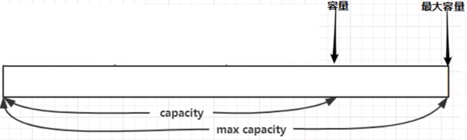
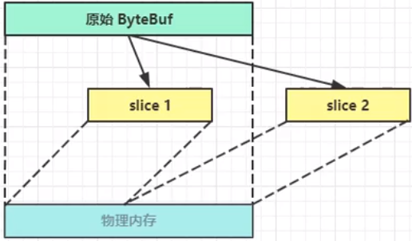

[TOC]

视频源：[黑马程序员Netty全套教程，全网最全Netty深入浅出教程，Java网络编程的王者](https://www.bilibili.com/video/BV1py4y1E7oA?p=1)

# 一. NIO基础

Non-Blocking IO 非阻塞IO

## 1. 三大组件

### 1.1 Channel & Buffer

channel 类似于 stream，就是读写数据的双向通道，可以从 channel 将数据读入 buffer，也可以将 buffer 的数据写入 channel，而 stream 要么是输入，要么是输出，channel 要比 stream 更为底层


常见的 channel 有：

- FileChannel
- DatagramChannel
- SocketChannel
- ServerSocketChannel

buffer 则用于缓冲数据，常见的 buffer 有：

- ByteBuffer
    - MappedByteBuffer
    - DirectByteBuffer
    - HeapByteBuffer
- ShortBuffer
- IntBuffer
- LongBuffer
- FloatBuffer
- DoubleBuffer
- CharBuffer

### 1.2 Selector

selector 单从字面意思不好理解，需要结合服务器的设计演化来理解他的用途

- 多线程设计版

    

    多线程的缺陷：

    1. 内存占用高
    2. 线程上下文切换成本高
    3. 只适合连接数少的场景

- 线程池设计

    

    线程池的缺陷：

    1. 阻塞模式下，线程仅能处理一个 socket 连接
    2. 仅适合短连接场景

- Selector 设计

    selector 的作用就是配合一个线程来管理多个 channel，获取这些 channel 上发生的事件，这些 channel 工作在非阻塞模式下，不会让线程吊死在一个 channel 上，适合连接数特别多，但流量特别低的场景（low traffic）

    

    调用 selector 的 select() 会阻塞直到 channel 发生了读写就绪事件，这些事件发生，select 方法就会返回这些事件交给 thread 来处理

## 2. ByteBuffer

### 2.1 ByteBuffer正确使用方法：

> 1. 向 buffer 写入数据，例如：调用 channel.read(buffer)
> 2. 调用 flip() 方法切换至 读模式
> 3. 从 buffer 读取数据，例如：调用buffer.get() 方法
> 4. 调用 clear() 或 compact() 切换至 写模式
> 5. 重复 1~4 步骤

示例程序：

注：data.txt 是一个含内容为"1234567890abc"的文本文件

```java
@Test
public void test() {
    try (FileChannel channel = new FileInputStream("data.txt").getChannel()) {
        // 准备缓冲区
        ByteBuffer buffer = ByteBuffer.allocate(10); // 10个字节的缓冲区
        // 从channel中读取数据，向 buffer 写入
        channel.read(buffer);
        // 打印 buffer 的内容
        buffer.flip(); // 切换至 读模式
        while (buffer.hasRemaining()) { // 是否还有剩余未读数据
            byte b = buffer.get(); // 读取一个字节
            logger.debug("读入字节 {}", (char)b);
        }
    } catch (IOException e) {
        e.printStackTrace();
    }
    /**
     * 打印结果只能看到10个数字，字母 abc 未能打印，是因为缓冲区大小只有10个字节，因此不能完全容纳文件内容，故不能全部打印
     */
}

@Test
public void allReadTest() {
    try (FileChannel channel = new FileInputStream("data.txt").getChannel()) {
        // 准备缓冲区
        ByteBuffer buffer = ByteBuffer.allocate(10); // 10个字节的缓冲区
        while (true) {
            // 从channel中读取数据，向 buffer 写入
            int len = channel.read(buffer);
            if (len == -1)
                break;
            logger.debug("字节数 {}", len);
            // 打印 buffer 的内容
            buffer.flip(); // 切换至 读模式
            while (buffer.hasRemaining()) { // 是否还有剩余未读数据
                byte b = buffer.get(); // 读取一个字符
                logger.debug("读入字节 {}", (char)b);
            }
            buffer.clear(); // 切换至 写模式
        }
    } catch (IOException e) {
        e.printStackTrace();
    }
    /**
     * read()方法返回值为读取到的数据量，当值为 -1 时表示以读取完毕，因此以此为标准验证是否已读取完毕
     */
}
```

### 2.2 ByteBuffer 结构

ByteBuffer 有以下重要属性：

- capacity - 容量
- position - 位置指针（索引）
- limit - 读写内容大小限制

起始状态：


写模式下，position 是写入位置，limit 等于容量。下图表示写入4个字节后的状态


flip() 动作发生后，position 切换为读取位置，limit 切换为读取限制


读取4个字节后状态


clear() 动作发生后，状态变为

后状态.png)

compact() 方法，是把未读完的部分向前压缩，然后切换至 写模式

后状态.png)

### 2.3 ByteBuffer 常见方法

#### 2.3.1 分配空间

使用 `allocate()` 方法为 ByteBuffer 分配空间，其他 buffer 类也有该方法

```java
ByteBuffer buffer = ByteBuffer.allocate(16);
```

`allocate()`分配内存，可以根据不通的方法分配在不通的位置

```java
System.out.println(ByteBuffer.allocate(16).getClass()); // class java.nio.HeapByteBuffer - 堆内存
System.out.println(ByteBuffer.allocateDirect(16).getClass); // class java.nio.DirectByteBuffer - 直接内存
```

在不同位置的区别：

- 堆内存上数据读写效率较低，直接内存上读写效率高（少一次拷贝）
- 堆内存上数据会受到 GC 影响，而直接内存不受 GC 影响
- 直接内存分配效率低，且容易造成内存泄漏

#### 2.3.2 向 buffer 中写入数据

有两种方法：

- 调用 channel 的 read 方法（channel 向 ByteBuffer 写入数据）
- 调用 ByteBuffer 自己的 put 方法

```java
int readBytes = channel.read(buffer);
buffer.put((byte)127);
```

#### 2.3.3 从 buffer 中读取数据

有两种方法：

- 调用 channel 的 write 方法（ByteBuffer 向 channel 中传入数据）
- 调用 ByteBuffer 自己的 get 方法

```java
int writeBytes = channel.write(buffer);
byte b = buffer.get();
```

ByteBuffer 的 `get()` 方法会让 position 读指针向后走，如果想重复读取数据，可以：

- 调用 `rewind()` 方法将 position 重置为0
- 调用 `get(int i)` 方法获取索引 i 位置的内容，它不会移动指针

#### 2.3.4 Mark & Reset

Mark 是做一个标记，记录 position 位置，Reset 是将 postion 重置到 Mark 的位置

#### 2.3.4 字符串与 ByteBuffer 转换

```java
@Test
public void string2BufferTest() {
    ByteBuffer buffer1 = StandardCharsets.UTF_8.encode("你好");
    ByteBuffer buffer2 = Charset.forName("UTF-8").encode("你好");

    debugAll(buffer1);
    debugAll(buffer2);

    CharBuffer buffer3 = StandardCharsets.UTF_8.decode(buffer1);
    logger.debug(buffer3.getClass());
    logger.debug(buffer3.toString());
}
```

结果：

```
+--------+-------------------- all ------------------------+----------------+
position: [0], limit: [6]
         +-------------------------------------------------+
         |  0  1  2  3  4  5  6  7  8  9  a  b  c  d  e  f |
+--------+-------------------------------------------------+----------------+
|00000000| e4 bd a0 e5 a5 bd 00 00 00 00 00                |...........     |
+--------+-------------------------------------------------+----------------+
+--------+-------------------- all ------------------------+----------------+
position: [0], limit: [6]
         +-------------------------------------------------+
         |  0  1  2  3  4  5  6  7  8  9  a  b  c  d  e  f |
+--------+-------------------------------------------------+----------------+
|00000000| e4 bd a0 e5 a5 bd 00 00 00 00 00                |...........     |
+--------+-------------------------------------------------+----------------+
2022-08-27 15:32:05.598 [main-102] DEBUG com.test.TestByteBuffer - class java.nio.HeapCharBuffer
2022-08-27 15:32:05.598 [main-103] DEBUG com.test.TestByteBuffer - 你好
```

### 2.4 Scattering Reads

分散读取，即将同一个 channel 的数据填充至多个 buffer

现有一个文件 test.txt，内容为 “onetwothree”，可以使用如下方法实现分散读取

```java
@Test
public void scatterReadTest() {
    try (FileChannel channel = new RandomAccessFile("data.txt", "rw").getChannel()) {
        ByteBuffer a = ByteBuffer.allocate(3);
        ByteBuffer b = ByteBuffer.allocate(3);
        ByteBuffer c = ByteBuffer.allocate(3);
        channel.read(new ByteBuffer[]{a, b, c});
        a.flip();
        b.flip();
        c.flip();
        debugAll(a);
        debugAll(b);
        debugAll(c);
    } catch (IOException e) {
        e.printStackTrace();
    }
}
```

### 2.5 Gathering Write

集中写入，即将多个 ByteBuffer 同时写入一个文件

```java
@Test
public void gatheringWriteTest() {
    // 集中写入
    ByteBuffer a = StandardCharsets.UTF_8.encode("hello");
    ByteBuffer b = StandardCharsets.UTF_8.encode("netty");
    ByteBuffer c = StandardCharsets.UTF_8.encode("你好");

    try (FileChannel channel = new RandomAccessFile("test.txt", "rw").getChannel()) {
        channel.write(new ByteBuffer[]{a, b, c});
    } catch (IOException e) {
    }
}
```

## 3. 文件编程

参考视频 P15~P21

## 4. 网络编程

客户端：

```java
import java.io.IOException;
import java.net.InetSocketAddress;
import java.nio.channels.SocketChannel;

public class Client {
    public static void main(String[] args) throws IOException {
        SocketChannel sc = SocketChannel.open();
        sc.connect(new InetSocketAddress("localhost", 8080));
        System.out.println("waiting....");
    }
}
```

可在打印处设置断点，debug模式下运行以保证程序不中断，以此建立一个简单的客户端程序，并按照以下方法，可以向服务端发送数据


### 4.1 阻塞模式

```java
@Test
/**
 * NIO 来理解阻塞模式，单线程
 * 阻塞模式下运行
 */
public void serverTestWithIO() throws IOException {
    // 0. ByteBuffer
    ByteBuffer buffer = ByteBuffer.allocate(16);
    // 1. 创建服务器
    ServerSocketChannel ssc = ServerSocketChannel.open();

    // 2. 绑定监听端口
    ssc.bind(new InetSocketAddress(8080));

    // 3. 连接集合
    List<SocketChannel> channels = new ArrayList<>();
    while (true) {
        log.debug("connecting...");
        // 4. accept 建立与客户端的连接
        // SocketChannel 用来与客户端之间通信
        SocketChannel sc = ssc.accept(); // 阻塞方法，线程停止运行，直至连接建立
        log.debug("connected... {}", sc);
        channels.add(sc);
        for (SocketChannel channel: channels) {
            log.debug("before read... {}", channel);
            channel.read(buffer); // 阻塞方法，线程停止运行，直至读入数据
            buffer.flip();
            debugRead(buffer);
            buffer.clear();
            log.debug("after read... {}", channel);
        }
    }
}
```

默认为阻塞模式，该模式下，`accept()` 方法及 `read()` 方法均会线程阻塞，程序不会继续向下执行

### 4.2 非阻塞模式

```java
@Test
/**
* NIO 来理解阻塞模式，单线程
* 非阻塞模式下运行
*/
public void serverTestWithNIO() throws IOException {
// 0. ByteBuffer
ByteBuffer buffer = ByteBuffer.allocate(16);
// 1. 创建服务器
ServerSocketChannel ssc = ServerSocketChannel.open();
ssc.configureBlocking(false); // accept非阻塞模式

// 2. 绑定监听端口
ssc.bind(new InetSocketAddress(8080));

// 3. 连接集合
List<SocketChannel> channels = new ArrayList<>();
while (true) {
    // 4. accept 建立与客户端的连接
    // SocketChannel 用来与客户端之间通信
    SocketChannel sc = ssc.accept(); // 非阻塞模式下，线程会继续运行，如果没有建立连接，sc会返回 null
    if (sc != null) {
        log.debug("connected... {}", sc);
        sc.configureBlocking(false); // read 非阻塞模式
        channels.add(sc);
    }
    for (SocketChannel channel: channels) {
        int read = channel.read(buffer); // 非阻塞模式下，线程会继续运行，如果没有读到数据，read将会返回0
        if (read > 0) {
            buffer.flip();
            debugRead(buffer);
            buffer.clear();
            log.debug("after read... {}", channel);
        }
    }
}
```

通过 `configureBlocking(false)` 方法，设置为非阻塞模式

> Tips:
>
> 非阻塞模式下，由于非阻塞模式的存在，循环体内数据会一直不停的运行，即使没有连接建立和数据接收，循环体也会不停的运行，造成 CPU 计算资源的浪费

### 4.3 Selector

#### 4.3.1 处理 accept

```java
@Test
public void selectorTest() throws IOException {
    //1. 创建 selector，管理多个 channel
    Selector selector = Selector.open();

    ByteBuffer buffer = ByteBuffer.allocate(16);
    ServerSocketChannel ssc = ServerSocketChannel.open();
    ssc.configureBlocking(false);

    // 2. 建立 selector 与 channel 的联系（注册）
    // SelectionKey 就是将来事件发生后，通过它可以知道事件和哪个 channel 的事件
    /**
     * 事件类型：
     *  ① accept - 会在有连接请求时触发
     *  ② connect - 是客户端连接建立后触发
     *  ③ read - 可读事件
     *  ④ write - 可写事件
     */
    // SelectionKey 只关注 accept 事件
    // SocketChannel 关注 read 与 write 事件
    SelectionKey sscKey = ssc.register(selector, 0, null);
    // sscKey 只关注 accept 事件
    sscKey.interestOps(SelectionKey.OP_ACCEPT);
    log.debug("register key {}", sscKey);

    ssc.bind(new InetSocketAddress(8080));

    List<SocketChannel> channels = new ArrayList<>();
    while (true) {
        // 3. select 方法，没有事件发生，线程阻塞；有事件发生，线程会恢复执行
        // select 在事件未处理时，它不会阻塞
        selector.select();
        // 4. 处理事件，selectedKeys() 内部包含了所有发生的事件
        Iterator<SelectionKey> iter = selector.selectedKeys().iterator();
        while (iter.hasNext()) {
            SelectionKey key = iter.next();
            log.debug("key: {}", key);
            ServerSocketChannel channel = (ServerSocketChannel)key.channel();
            SocketChannel accept = channel.accept();
            log.debug("{}", accept);
        }
    }
}
```

事件类型：

1. accept - 会在有连接请求时触发
2. connect - 是客户端连接建立后触发
3. read - 可读事件
4. write - 可写事件

#### 4.3.2 cancel

```java
@Test
public void selectorTest() throws IOException {
    Selector selector = Selector.open();

    ByteBuffer buffer = ByteBuffer.allocate(16);
    ServerSocketChannel ssc = ServerSocketChannel.open();
    ssc.configureBlocking(false);

    SelectionKey sscKey = ssc.register(selector, 0, null);
    sscKey.interestOps(SelectionKey.OP_ACCEPT);
    log.debug("register key {}", sscKey);

    ssc.bind(new InetSocketAddress(8080));

    List<SocketChannel> channels = new ArrayList<>();
    while (true) {
        selector.select();
        Iterator<SelectionKey> iter = selector.selectedKeys().iterator();
        while (iter.hasNext()) {
            SelectionKey key = iter.next();
            log.debug("key: {}", key);
        }
    }
}
```

如上，仅仅是不做 channel 处理，程序将又会进入非阻塞模式，循环体将会一直执行，持续消耗 CPU 计算资源，其原因是因为没有对 channel 进行处理，select 在事件未处理时，它不会阻塞，所以程序会持续运行。因此，事件发生后，要么处理，要么通过 `cancel()` 方法取消，不能置之不理，如上可在循环体内修改为：

```java
while (true) {
    selector.select();
    Iterator<SelectionKey> iter = selector.selectedKeys().iterator();
    while (iter.hasNext()) {
        SelectionKey key = iter.next();
        log.debug("key: {}", key);
        key.cancel(); // 取消处理
    }
}
```

#### 4.3.3 处理 read

`SelectionKey` 中存在判别事件类别的方法，`isAcceptable()` 判断事件是否是 accept 事件，`isReadable()` 判断事件是否是 read 事件，可以以此为依据，对不同事件采取不同处理策略

```java
......
while (iter.hasNext()) {
    SelectionKey key = iter.next();
    log.debug("key: {}", key);
    // 5. 区分事件类型
    if (key.isAcceptable()) { // 是 accept 事件
        ServerSocketChannel channel = (ServerSocketChannel) key.channel();
        SocketChannel sc = channel.accept();
        sc.configureBlocking(false);
        SelectionKey scKey = sc.register(selector, 0, null);
        scKey.interestOps(SelectionKey.OP_READ);
        log.debug("{}", sc);
    } else if (key.isReadable()) { // 是 read 事件
        SocketChannel channel = (SocketChannel)key.channel(); // 拿到触发事件的 channel
        ByteBuffer allocate = ByteBuffer.allocate(16);
        int read = channel.read(allocate);
        allocate.flip();
        debugRead(allocate);
    }
}
```

测试以上代码发现，建立连接触发正常，但触发 read 事件会抛出空指针异常，是因为 Selector 会在事件发生后，向 `selectedKeys()` 中加入注册的 `SelectionKey`，但不会主动从 `selectedKeys()` 中删除元素，所以在上述代码中，经过第一轮建立连接后，`selectedKeys()` 中存在 `sscKey`，但处理该连接事件之后，`sscKey` 不会主动从 `selectedKeys()` 中移除，因此在第二轮 read 事件触发时，`selectedKeys()` 中会加入一个新的元素 `scKey`，且 `sscKey` 仍存在其中。迭代器遍历 `selectedKeys()` 时，因为没有新的连接建立，遍历至 `sscKey` 时，即会触发空指针异常。所以，<font color=red size=4>**处理 key 时，要从 selectedKeys 集合中删除，否则 key 将一直保留在 selectedKeys 中，导致下次处理出现异常**</font>

```
......
while (iter.hasNext()) {
    SelectionKey key = iter.next();
    log.debug("key: {}", key);
    
    // 处理 key 时，要从 selectedKeys 集合中删除，否则 key 将一直保留在 selectedKeys 中，导致下次处理出现异常
    iter.remove();
    
    // 5. 区分事件类型
    if (key.isAcceptable()) { // 是 accept 事件
        ServerSocketChannel channel = (ServerSocketChannel) key.channel();
        SocketChannel sc = channel.accept();
        sc.configureBlocking(false);
        SelectionKey scKey = sc.register(selector, 0, null);
        scKey.interestOps(SelectionKey.OP_READ);
        log.debug("{}", sc);
    } else if (key.isReadable()) { // 是 read 事件
        SocketChannel channel = (SocketChannel)key.channel(); // 拿到触发事件的 channel
        ByteBuffer allocate = ByteBuffer.allocate(16);
        int read = channel.read(allocate);
        allocate.flip();
        debugRead(allocate);
    }
}
```

# 二. Netty 入门

## 1. 概述

### 1.1 Netty 是什么

> Netty is an asynchronous event-driven network application framework for rapid development of maintainable high performance protocol servers & clients.

Netty 是一个异步的、基于事件驱动的网路应用框架，用于快速开发可维护、高性能的网络服务器和客户端

### 1.2 Netty 的地位

Netty 在 Java 应用网络框架中的地位就好比 Spring 在 Java EE 开发中的地位

以下框架都使用了 Netty，因为他们都有网络通信需求

- Cassandra - nosql 数据库
- Spark - 大数据分布式计算框架
- Hadoop - 大数据分布式存储框架
- RocketMQ - ali 开源的消息队列
- ElasticSearch - 搜索引擎
- gRPC - rpc 框架
- Dubbo - rpc 框架
- Spring 5.x - flux api 完全抛弃了 tomcat，使用 Netty 作为服务器端
- Zookeeper - 分布式协调框架

### 1.3 Netty 的优势

- Netty vs NIP，工作量大，bug 多
  - 需要自己构建协议
  - 解决 TCP 传输问题，如粘包、半包
  - epoll 空轮询导致 CPU 100%
  - 对 API 进行增强，使之更易用，如 FastThreadLocal => ThreadLocal, ByteBuf => ByteBuffer
- Netty vs 其他网络应用框架
  - Mina 由 apache 维护，将来 3.x 版本可能会有较大重构，破坏 api 向下兼容性，Netty 的开发迭代更迅速，api 更简洁，文档更优秀
  - 久经考验，16年，Netty 版本
    - 2.x 2004
    - 3.x 2008
    - 4.x 2013
    - 5.x 已废弃（没有明显的性能提升，维护成本高）

## 2. Hello World

### 2.1 目标

开发一个简单的服务器端和客户端

- 客户端向服务器端发送 Hello, world
- 服务器仅接收，不返回

服务器

```java
package com.test.utils.helloword;

import io.netty.bootstrap.ServerBootstrap;
import io.netty.channel.ChannelHandlerContext;
import io.netty.channel.ChannelInboundHandlerAdapter;
import io.netty.channel.ChannelInitializer;
import io.netty.channel.nio.NioEventLoopGroup;
import io.netty.channel.socket.nio.NioServerSocketChannel;
import io.netty.channel.socket.nio.NioSocketChannel;
import io.netty.handler.codec.string.StringDecoder;
import lombok.extern.slf4j.Slf4j;

@Slf4j
public class Server {
    public static void main(String[] args) {
        // 1. 服务端 启动器，负责组装 Netty 组件，启动服务器
        new ServerBootstrap()
                // 2. BossEventLoop WorkerEventLoop(selector, thread), group
                .group(new NioEventLoopGroup())
                // 3. 选择服务器的 ServerSocketChannel 实现
                .channel(NioServerSocketChannel.class)
                // 4. boss 负责处理连接 worker(child) 负责处理读写，决定了 worker(child)能执行哪些操作(handler)
                .childHandler(
                        // 5. channel 代表和客户端进行数据读写的通道 Initializer 初始化，负责添加其他 handler
                        new ChannelInitializer<NioSocketChannel>() {
                    @Override
                    protected void initChannel(NioSocketChannel nioSocketChannel) throws Exception {
                        // 6. 添加具体 handler
                        nioSocketChannel.pipeline().addLast(new StringDecoder()); // 将 ByteBuf 转化为字符串
                        nioSocketChannel.pipeline().addLast(new ChannelInboundHandlerAdapter() { // 自定义 handler
                            @Override // 读事件
                            public void channelRead(ChannelHandlerContext ctx, Object msg) throws Exception {
                                log.debug(msg.toString());
                            }
                        });
                    }
                })
                // 7. 绑定监听端口
                .bind(8080);
    }
}
```

客户端

```java
package com.test.utils.helloword;

import io.netty.bootstrap.Bootstrap;
import io.netty.channel.ChannelHandlerContext;
import io.netty.channel.ChannelInboundHandlerAdapter;
import io.netty.channel.ChannelInitializer;
import io.netty.channel.nio.NioEventLoopGroup;
import io.netty.channel.socket.nio.NioSocketChannel;
import io.netty.handler.codec.string.StringEncoder;
import lombok.extern.slf4j.Slf4j;

import java.net.InetSocketAddress;

@Slf4j
public class Client {
    public static void main(String[] args) throws InterruptedException {
        // 1. 启动器
        new Bootstrap()
                // 2. 添加 EventLoop
                .group(new NioEventLoopGroup())
                // 3. 选择客户端 channel 实现
                .channel(NioSocketChannel.class)
                // 4. 添加处理器
                .handler(new ChannelInitializer<NioSocketChannel>() {
                    @Override // 在连接建立后调用
                    protected void initChannel(NioSocketChannel nioSocketChannel) throws Exception {
                        nioSocketChannel.pipeline().addLast(new StringEncoder()); // 将 ByteBuf 转换为字符串
                        nioSocketChannel.pipeline().addLast(new ChannelInboundHandlerAdapter() {
                            @Override
                            public void channelRead(ChannelHandlerContext ctx, Object msg) throws Exception {
                                log.debug(msg.toString());
                            }
                        });
                    }
                })
                // 5. 连接到服务器
                .connect(new InetSocketAddress("localhost", 8080))
                .sync()
                .channel()
                // 6. 向服务器发送数据
                .writeAndFlush("Hello world");
    }
}
```

### 2.2 流程分析


- 把 channel 理解为数据的通道
- 把 msg 理解为流动的数据，最开始输入的是 ByteBuf，但经过 pipeline 的加工，会变成其他类型对象，最后输出又变成 ByteBuf
- 把 handler 理解为数据的处理工序
  - 工序有多道，合在一起就是 pipeline，pipeline 负责发布事件（读、读取完成、写等事件）传播给每个 handler，handler 对自己感兴趣的事件将进行处理（重写了相应事件处理方法）
  - handler 分 Inbound（入站，写入） 和 Outbound（出站，写出） 两类
- 把 enentLoop 理解为处理数据的工人
  - 工人可以管理多个 channel 的 IO 操作，并且一旦工人负责了某个 channel，就要负责到底（绑定）
  - 工人既可以执行 IO 操作，也可以进行任务处理，每位工人有任务队列，队列里可以堆放多个 channel 的待处理任务，任务分为普通任务、定时任务
  - 工人按照 pipeline 顺序，依次按照 handler 的规划（代码）处理数据，可以为每道工序指定不同的工人

## 3. 组件

### 3.1 EventLoop

事件循环对象

EventLoop 本质是一个单线程执行器（同时维护了一个 Selector），里面有 run 方法处理 Channel 上源源不断的 IO 事件

它的继承关系比较复杂

- 一条线是继承自 `j.u.c.ScheduledExecutorService` 因此包含了线程池中所有的方法
- 另一条线是继承自 Netty 自己的 `OrderedEventExecutor`
  - 提供了 `boolean inEventLoop(Thread thread)` 方法判断一个线程是否属于此 EventLoop
  - 提供了 parent 方法来看自己属于哪个 EventLoop

事件循环组

EventLoopGroup 是一组 EventLoop，Channel 一般会调用 EventLoopGroup 的 register 方法来绑定其中一个 EventLoop，后续这个 Channel 上的 IO 事件都由此 EventLoop 来处理（保证了 IO 事件处理时的线程安全）

- 继承自 Netty 的 EventExecutorGroup
  - 实现了 Iterable 接口提供遍历 EventLoop 的能力
  - 另有 next 方法获取集合中下一个 EventLoopdd

实例：

```java
package com.test.utils.eventloop;

import io.netty.channel.EventLoopGroup;
import io.netty.channel.nio.NioEventLoopGroup;
import lombok.extern.slf4j.Slf4j;

import java.util.concurrent.TimeUnit;

@Slf4j
public class EventGroupTest {
    public static void main(String[] args) {
        // 1. 创建事件循环组
        EventLoopGroup group = new NioEventLoopGroup(2); // IO 事件，普通任务，定时任务
//        EventLoopGroup group = new DefaultEventLoop(); // 普通任务，定时任务
        // 2. 获取下一个事件循环对象
        System.out.println(group.next());
        System.out.println(group.next());
        System.out.println(group.next());
        System.out.println(group.next());

        // 3. 执行普通任务
//        group.next().submit(() -> {
//            try {
//                Thread.sleep(1000);
//            } catch (InterruptedException e) {
//                e.printStackTrace();
//            }
//            log.debug("OK");
//        });

        // 4. 执行定时任务
        group.next().scheduleAtFixedRate(() -> {
            log.debug("OK");
        }, 0, 1, TimeUnit.SECONDS);

        log.debug("main");
    }
}
```

### 3.2 Channel

channel 的主要作用

- `close()` 可以用来关闭 channel
- `closeFuture()` 用来处理 channel 的关闭
    - `sync()` 方法作用是同步等待 channel 关闭
    - `addListener()` 方法是异步等待 channel 关闭
- `pipeline()` 方法添加处理器
- `write()` 方法将数据写入 channel，但并不一定会将数据立马发出去（存在缓冲机制）
- `writeAndFlush()` 方法将数据写入并刷出

#### 3.2.1 Channel 的连接建立

```java
ChannelFuture future = ...
    .connect(new InetSocketAddress("localhost", 8080));

// 阻塞方式等待连接建立
future.sync()
    .channel()
    .writeAndFlush("Hello World");

// 异步等待连接建立
future.addListener(new ChannelFutureListener() {
    @Override
    public void operationComplete(ChannelFuture channelFuture) throws Exception {
        channelFuture
            .channel()
            .writeAndFlush("Hello World");
    }
});
```

#### 3.2.2 Channel 的连接关闭

```java
package com.test.utils.channel;

import io.netty.bootstrap.Bootstrap;
import io.netty.channel.Channel;
import io.netty.channel.ChannelFuture;
import io.netty.channel.ChannelFutureListener;
import io.netty.channel.ChannelInitializer;
import io.netty.channel.nio.NioEventLoopGroup;
import io.netty.channel.socket.nio.NioSocketChannel;
import io.netty.handler.codec.string.StringEncoder;
import lombok.extern.slf4j.Slf4j;

import java.net.InetSocketAddress;
import java.util.Scanner;

/**
 * @Author Tiechui Wang
 * @Date 2022-08-31 14:35
 * @description
 */

@Slf4j
public class CloseFutureClient {
    public static void main(String[] args) throws InterruptedException {
        NioEventLoopGroup group = new NioEventLoopGroup();
        ChannelFuture future = new Bootstrap()
                .group(group)
                .channel(NioSocketChannel.class)
                .handler(new ChannelInitializer<NioSocketChannel>() {
                    @Override
                    protected void initChannel(NioSocketChannel nioSocketChannel) throws Exception {
                        nioSocketChannel.pipeline().addLast(new StringEncoder());
                    }
                })
                .connect(new InetSocketAddress("localhost", 8080));
        
        Channel channel = future.sync().channel();
        new Thread(() -> {
            Scanner scanner = new Scanner(System.in);
            while (true) {
                String line = scanner.nextLine();
                if ("q".equals(line)) {
                    channel.close(); // channel 关闭操作也是一个异步方法
                    log.debug("错误进行处理关闭之后的操作"); // 在这里进行关闭 channel 后的操作并不可靠
                    break;
                }
                channel.writeAndFlush(line);
            }
        }, "input").start();

        /**
         * 获取 CloseFuture 对象
         */
        // 1. 同步阻塞方式来处理关闭 channel 后的操作
        ChannelFuture closeFuture = channel.closeFuture();
        closeFuture.sync(); // 阻塞关闭操作
        log.debug("正确进行处理关闭之后的操作");
        
        // 2. 异步等待 channel 关闭连接
        closeFuture.addListener(new ChannelFutureListener() {
            @Override
            public void operationComplete(ChannelFuture channelFuture) throws Exception {
                log.debug("正确进行处理关闭之后的操作");
                group.shutdownGracefully(); // 关闭 group
            }
        });
    }
}
```

### 3.3 Future & Promise

在异步处理过程中，经常用到这两个接口

Netty 中的 Future 和 JDK 中的 Future 同名，但是是两个接口，Netty 的 Future 继承自 JDK 的 Future，而 Promise 又对 Netty 的 Future 进行了扩展。

- JDK Future 只能同步等待任务结束（成功/失败）才能得到结果
- Netty Future 可以同步等待任务结束得到结果，也可以异步方式得到结果，但都要等待任务结束
- Netty Promise 不仅有 Netty Future 的功能，而且脱离了任务独立存在，只作为两个线程之间传递结果的容器

|  功能/名称  |            JDK Future             |                         Netty Future                         |   Promise    |
| :---------: | :-------------------------------: | :----------------------------------------------------------: | :----------: |
|   cancel    |             取消任务              |                              -                               |      -       |
| isCanceled  |           任务是否取消            |                              -                               |      -       |
|   isDone    | 任务是否完成（不能区分成功/失败） |                              -                               |      -       |
|     get     |      获取任务结果，阻塞等待       |                              -                               |      -       |
|   getNow    |                 -                 |         获取任务结果，非阻塞，未产生结果时返回 Null          |      -       |
|    await    |                 -                 | 等待任务结束，如果任务失败，不会抛异常，而是通过 isSuccess 判断 |      -       |
|    sync     |                 -                 |             等待任务结束，如果任务失败，抛出异常             |      -       |
|  isSuccess  |                 -                 |                       判断任务是否成功                       |      -       |
|    cause    |                 -                 |         获取失败信息，非阻塞，如果没有失败返回 Null          |      -       |
| addListener |                 -                 |                    添加回调，异步接受结果                    |      -       |
| setSuccess  |                 -                 |                              -                               | 设置成功结果 |
| setFailure  |                 -                 |                              -                               | 设置失败结果 |

### 3.4 Handler & Pipeline

ChannelHandler 用来处理 Channel 上的各种事件，分为入站、出站两种。所有 ChannelHandler 被连在一起，就是 Pipeline

- 入站处理器通常是 ChannelInboundHandlerAdapter 的子类，主要用来读取客户端数据，写回结果
- 出站处理器通常是 ChannelOutboundHandlerAdapter 的子类，主要对写回结果进行加工过

如果每个 Channel 是一个产品的加工车间，Pipeline 就是车间中的流水线，ChannelHandler 就是流水线上的各道工序，而 ByteBuf 则是原材料，经过很多工序的加工：先经过一道道入站工序，再经过一道道出站工序最终变成产品

- InboundHandler

    通过 `super.hannelRead(ChannelHandlerContext, obj)` 或 `ChannelHandlerContext.fireChannelRead(obj)` 将数据传递给下个 Handler，如果不调用，Handler 将会断开

    ```java
    new ServerBootstrap()
        .group(new NioEventLoopGroup())
        .channel(NioServerSocketChannel.class)
        .childHandler(
                new ChannelInitializer<NioSocketChannel>() {
            @Override
            protected void initChannel(NioSocketChannel nioSocketChannel) throws Exception {
                // 处理器顺序 head -> handler1 -> handler2 -> ... -> tail
                nioSocketChannel.pipeline().addLast("handler1", new ChannelInboundHandlerAdapter() {
                    @Override
                    public void channelRead(ChannelHandlerContext ctx, Object msg) throws Exception {
                        super.channelRead(ctx, msg); // 向下传递
                    }
                });
                nioSocketChannel.pipeline().addLast("handler2", new ChannelInboundHandlerAdapter() {
                    @Override
                    public void channelRead(ChannelHandlerContext ctx, Object msg) throws Exception {
                        ctx.fireChannelRead(msg); // 向下传递
                    }
                });
                ...
            }
        })
        .bind(8080);
    ```

- OutboundHandler

    **只有存在写出操作才会触发 OutboundHandler**

    ```java
    new ServerBootstrap()
        .group(new NioEventLoopGroup())
        .channel(NioServerSocketChannel.class)
        .childHandler(
                new ChannelInitializer<NioSocketChannel>() {
            @Override
            protected void initChannel(NioSocketChannel nioSocketChannel) throws Exception {
                // 处理器顺序 head -> handler1 -> write1 -> write2 -> ... -> tail
                nioSocketChannel.pipeline().addLast("handler1", new ChannelInboundHandlerAdapter() {
                @Override
                public void channelRead(ChannelHandlerContext ctx, Object msg) throws Exception {
                    nioSocketChannel.writeAndFlush("Hello");
                }
            });
            nioSocketChannel.pipeline().addLast("write1", new ChannelOutboundHandlerAdapter(){
                @Override
                public void write(ChannelHandlerContext ctx, Object msg, ChannelPromise promise) throws Exception {
                    super.write(ctx, msg, promise);
                }
            });
            nioSocketChannel.pipeline().addLast("write2", new ChannelOutboundHandlerAdapter(){
                @Override
                public void write(ChannelHandlerContext ctx, Object msg, ChannelPromise promise) throws Exception {
                    super.write(ctx, msg, promise);
                }
            });
            }
        })
        .bind(8080);
    ```

    但 `OutboundHandler` 是从尾部开始向前查找 OutboundHandler，所以其执行顺序是 write2 -> write1

    `ctx.writeAndFlush()` 其与 `channel.wrteAndFlush()` 的区别在于：前者会从当前位置向前查找 OutboundHandler，而后者则会从尾部 tail 向前查找 OutboundHandler


- EmbededHandler

    方便测试 Hander，无需启动服务端与客户端

    ```java
    @Slf4j
    public class EmbededChannelTest {
        public static void main(String[] args) {
            ChannelInboundHandlerAdapter r1 = new ChannelInboundHandlerAdapter() {
                @Override
                public void channelRead(ChannelHandlerContext ctx, Object msg) throws Exception {
                    log.debug("r1");
                    super.channelRead(ctx, msg);
                }
            };
            
            ChannelInboundHandlerAdapter r2 = new ChannelInboundHandlerAdapter() {
                @Override
                public void channelRead(ChannelHandlerContext ctx, Object msg) throws Exception {
                    log.debug("r2");
                    super.channelRead(ctx, msg);
                }
            };
    
            ChannelOutboundHandlerAdapter w1 = new ChannelOutboundHandlerAdapter() {
                @Override
                public void write(ChannelHandlerContext ctx, Object msg, ChannelPromise promise) throws Exception {
                    log.debug("w1");
                    super.write(ctx, msg, promise);
                }
            };
            
            ChannelOutboundHandlerAdapter w2 = new ChannelOutboundHandlerAdapter() {
                @Override
                public void write(ChannelHandlerContext ctx, Object msg, ChannelPromise promise) throws Exception {
                    log.debug("w2");
                    super.write(ctx, msg, promise);
                }
            };
    
            EmbeddedChannel channel = new EmbeddedChannel(r1, r2, w1, w2);
            // 模拟入站
            channel.writeInbound(ByteBufAllocator.DEFAULT.buffer().writeBytes("hello".getBytes(StandardCharsets.UTF_8)));
            // 模拟出站
            channel.writeOutbound(ByteBufAllocator.DEFAULT.buffer().writeBytes("world".getBytes(StandardCharsets.UTF_8)));
        }
    }
    ```

### 3.5 ByteBuf

是对字节数据的封装

#### 3.5.1 创建

```java
ByteBuf buffer = ByteBufAllocator.DEFAULT.buffer(); // 默认容量256
ByteBuf buffer = ByteBufAllocator.DEFAULT.buffer(10); // 指定容量10
```

ByteBuf 是自己可以扩容的

#### 3.5.2 直接内存、堆内存

可以使用下面方法创建池化基于堆的 ByteBuf

```java
ByteBuf buffer = ByteBufAllocator.DEFAULT.heapBuffer();
```

也可以使用下面方法创建池化基于内存的 ByteBuf

```java
ByteBuf buffer = ByteBufAllocator.DEFAULT.directBuffer();
```

- 直接内存创建和销毁代价昂贵，但读写性能高（少一次内存复制），适合配合池化功能一起使用
- 直接内存堆 GC 压力小，因为这部分内存不受 JVM 垃圾回收的管理，但也要注意及时主动释放

#### 3.5.3 池化、非池化

池化的最大意义在于可以重用 ByteBuf，优点：

- 没有池化，则每次都得创建新的 ByteBuf 实例，这个操作对直接内存代价昂贵，就算是堆内存，也会增加 GC 压力
- 有了池化，可以重用池中 ByteBuf 实例，并且采用了与 jemalloc 类似的内存分配算法提升分配效率
- 高并发时，池化功能更节约内存，减少内存溢出的可能

池化功能是否开启，可以通过下面的系统环境变量来设置

```java
-Dio.netty.allocator.type={unpooled|pooled}
```

- 4.1 以后，非 Android 平台默认启用池化实现，Android 平台启用非池化实现
- 4.1 之前，池化功能还不成熟，默认是非池化实现

#### 3.5.4 组成

ByteBuf 由4部分组成：读指针、写指针、容量及最大容量

最开始读写指针都在 0 位置



#### 3.5.5 写入

|                       方法名                        |         含义          |                    备注                     |
| :-------------------------------------------------: | :-------------------: | :-----------------------------------------: |
|            `writeBoolean(boolean value)`            |    写入 boolean 值    |  用一个字节 01 \| 00 来表示 ture \| false   |
|               `writeByte(int value)`                |     写入 byte 值      |                                             |
|               `writeShort(int value)`               |     写入 short 值     |                                             |
|                `writeInt(int value)`                |      写入 int 值      |  Big Endian，即0x250，写入后为 00 00 02 50  |
|               `writeIntLE(int value)`               |      写入 int 值      | Little Endian，即0x250，写入后为50 02 00 00 |
|               `writeLong(long value)`               |     写入 long 值      |                                             |
|               `writeChar(int value)`                |     写入 char 值      |                                             |
|              `writeFloat(float value)`              |     写入 float 值     |                                             |
|             `writeDouble(double value)`             |    写入 double 值     |                                             |
|              `writeBytes(ByteBuf src)`              | 写入 Netty 的 ByteBuf |                                             |
|              `writeBytes(byte[] src)`               |      写入 byte[]      |                                             |
| `writeCharsSequence(CharSequence, Charset charset)` |      写入字符串       |                                             |

> Tips:
>
> - 以上方法都是未指明返回值的，意味着可以链式调用
> - 网络传输，默认习惯是 Big Endian

#### 3.5.6 扩容

当 ByteBuf 写入容量不够时，这时会引发扩容，扩容规则是：

- 如果写入数据后大小未超过512，则选择下一个16的整数倍，如：写入后大小为12，则扩容后 capacity 是16
- 如果写入后护具大小超过512，则选择下一个2^n，如：写入后大小为513，则扩容后 capacity 是1024
- 扩容不能超过 MAX CAPACITY，否则会报错

#### 3.5.7 读取

`ByteBuf.readByte()` 方法，每次读取一个字节，读指针向前移动1，再读只能读取尚未读取的部分

`ByteBuf.markReadrIndex()` 与 `ByteBuf.resetReaderIndex()` 在字节出做标记与恢复至标记点，可以实现对指定位置的重复读取

#### 3.5.8 retain & release 内存回收

#### 3.5.9 slice

“零拷贝”的体现之一，对原始 ByteBuf 进行切片成多个 ByteBuf，切片后的 ByteBuf 并没有发生内存复制（逻辑切片），还是使用原始 ByteBuf 的内存，切片后的 ByteBuf 维护独立的 read、write 指针



#### 3.5.10 composite

将多个 ByteBuf 拼接成一个 ByteBuf，拼接的过程中同样没有内存复制（逻辑拼接）

```java
ComositByteBuf buf = ByteBufAllocator.DEFAULT.compositeBuffer();
buf.addComponents(true, buf1, buf2);
```

ByteBuf 的优势

- 池化 - 可以重用池中的 ByteBuf 实例，更节约内存，减少内存溢出的可能
- 读写指针分离，不需要像 ByteBuf 一样切换读写wwwwwwwww模式
- 可以自动扩容
- 支持链式调用，使用更流畅
- 诸多实例体现零拷贝，如：`slice()` \ `duplicate()` \ `CompoiteByteBuf()`

# 三. Netty 进阶

## 1. 粘包与半包

### 1.1 粘包现象

### 1.2 半包现象

#### 1.2.1 定长解码器

如果报文长度固定，可以利用定长解码器`FixedLengthFrameDecoder(frameLength)`

```java
serverBootstrap.childHandler(new ChannelInitializer<SocketChannel>() {
    @Override
    protected void initChannel(SocketChannel ch) throws Exception {
        ch.pipiline().addLast(new FixedLengthFrameDecoder(10));
    }
})
```

#### 1.2.2 行解码器

以换行符为分隔符("\n"或"\r \n")分割报文，则可以利用该解码器`LineBasedFrameDecoder(maxLength)`，使用该解码器时需要指定一个最大帧长度

#### 1.2.3 自定义分隔符解码器

`DelimiterBasedFrameDecoder(int maxLength, ByteBuf delimiter)`类似于行解码器，可以自定义一个分隔符来分割报文，但同样需要指定最大帧长度

#### 1.2.4 LTC解码器

`LengthFieldBasedFrameDecoder(int maxFrameLength, int lengthFieldOffset, int lengthFieldLength, int lengthAdjustment, int initialBytesToStrip)`

- maxFrameLength: 帧最大长度
- lengthFieldOffset: 长度字段偏移量
- lenthFieldLength: 长度字段长度
- lengthAdjustment: 除去长度字段为基准，还有多少字节是内容
- initialBytesToStrip: 从头剥离几个字节
