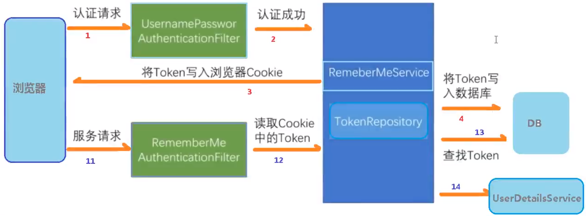

[TOC]

# 一. Spring Security 框架简介

## 1. 概要

Spring Security 基于 Spring 框架，提供了一套 Web 应用安全性的完整解决方案。安全方面的两个主要区域是“<font color=red>认证</font>”和“<font color=red>授权</font>”（或者访问控制）。一般来说，Web 应用的安全性包括**<font color=red>用户认证（Authentication）和用户授权（Authorization）</font>**两个部分，这两点是 Spring Security 的重要核心功能

1) 用户认证指的是：验证某个用户是否为系统中的合法主体，也就是说用户能否访问该系统。用户认证一般要求用户提供用户名和密码。系统通过校验用户名和密码来完成认证过程。<font color=blue>通俗些来说就是系统认为用户是否能够登录</font>
2) 用户授权指的是：验证某个用户是否有权执行某个操作。在一个系统中，不同用户所具有的权限是不同的。比如对一个文件来说，有的用户只能进行读取，而有的用户可以进行修改。一般来说，系统会为不同的用户分配不同的角色，而每个角色则对应一系列的权限。<font color=blue>通俗些来说就是判断用户是否有权限去做某些事情</font>

## 2. 同款产品分析

### 2.1 Spring Security

特点：

- 和 Spring 无缝整合
- 全面的权限控制
- 专门为 Web 开发而设计
    - 旧版本不能脱离 Web 环境使用
    - 新版本对整个框架进行了分层抽取，分成了核心模块和 Web 模块。单独引入核心模块就可以脱离 Web 环境
- 重量级框架

### 2.2 Shiro

特点：

- 轻量级

    Shiro 主张的理念是把复杂的事情变简单，针对对性能有更高要求的互联网应用有更好表现

- 通用姓
    - 优势：不局限于 Web 环境，可以脱离 Web 环境使用
    - 劣势：在 Web 环境下一些特定的需求需要手动编写代码定制

Spring Security 是 Spring 家族中的一个安全管理框架，实际上，在 Spring Boot 出现之前，Spring Security 已经发展了很多年，但是使用的并不多，安全管理这个领域，一直是 Shiro 的天下

相对于 Shiro，在 SSM 中整合 Spring Security 都是比较麻烦的操作，所以 Spring Security 虽然功能比 Shiro 强大，但是使用反而没有 Shiro 多（Shiro 虽然功能没有 Spring Security 多，但是对于大部分项目而言，Shiro 已经足够使用）

自从有了 Spring Boot，Spring Boot 对于 Spring Security 提供了自动化配置方案，可以使用更少的配置来使用 Spring Security

因此，一般来说，常见的安全管理技术栈的组合是这样的

- SSM + Shiro
- Spring Boot/ Spring Cloud + Spring Security

# 二. Spring Security 基本原理

Spring Security 本质是一个过滤器链，重点有三个过滤器

1. FilterSecurityInterceptor

    一个方法级的权限过滤器，基本位于过滤链的最底部

    `super.beforeInvocation(fi)`表示查看之前的 filter 是否通过

    `fi.getChain().doFilter(fi.getRequest(), fi.getResponse())`表示真正的调用后台的服务

2. ExceptionTranslationFilter

    一个异常过滤器，用来处理在认证授权过程中抛出的异常

3. UsernamePasswordAuthenticationFilter

    对 /login 的POST请求做拦截，校验表单中的用户名、密码

## 1. UserDetailService 接口

在没有配置的时候，账号和密码都是由 Spring Security 定义生成，而在实际项目中账号和密码都是从数据库中查出来的，所以要通过自定义逻辑控制认真逻辑

如果需要自定义逻辑时，需要实现 UserDetailsService 接口即可。接口定义如下：

```java
public interface UserDetailsService {
    ......
    UserDetails laodUserByUsername(String username) throws UsernameNotFoundException;
}
```

要在实现该接口的方法中编写查询数据过程，并返回 User 对象，此对象为安全框架提供对象，而非数据实体类

- 返回值 UserDetails

    这个类的系统默认的用户“主体”

    ```java
    // 获取登录用户所有权限
    Collection<? extends GrantedAuthority> getAuthorities();
    
    // 获取密码
    String getPassword();
    
    // 获取用户名
    String getUsername();
    
    // 判断账户是否过期
    boolean isAccountNonExpired();
    
    // 判断账户是否被锁定
    boolean isAccountNonLocked();
    
    // 凭证{密码}是否过期
    boolean isCredentialsNonExpired();
    
    // 当前用户是否可用
    boolean isEnabled();
    ```

## 2. PasswordEncoder 接口

```java
// 把参数按照特定的解析规则进行解析
String encode(CharSequence rawPassword);

// 验证从存储中获取的编码密码与编码后提交的原始密码是否匹配。如果密码匹配，则返回true；如果不匹配，则返回false。第一个参数表示需要被解析的密码，第二个参数表示存储的密码
boolean matches(CharSequence rawPassword, String encodedPassword);

// 如果解析的密码能够再次进行解析且达到更安全的结果，则返回true，否则返回false。默认返回false
default boolean upgradeEncoding(String encodedPassword) {
    return false;
};
```

数据加密接口，用于返回 User 对象里面密码加密

- BCryptPasswordEncoder 示例

BCryptPasswordEncoder 是 Spring Security 官方推荐的密码解析器，一般主要使用该解析器

BCryptPasswordEncoder 是对 bcrypt 强散列方法的具体实现，是基于 Hash 算法实现的单向加密，可以通过 strength 控制加密强度， 默认为10

```java
@Test
public void test01() {
    // 创建密码解析器
    BCryptPasswordEncoder bCryptPasswordEncoder = new BCryptPasswordEncoder();
    // 对密码进行加密
    String password = bCryptPasswordEncoder.encode("password");
    
    // 判断原字符加密后和加密前是否匹配
    boolean result = bCryptPasswordEncoder.matches("password", password);
}
```

# 三. Web 权限方案

Web 权限方案分两种：1) 认证；2) 授权

## 1. 认证

设置登录的用户名和密码，有三种实现方式

1. 通过 Spring Boot 配置文件 application.properties 配置

    ```properties
    spring.security.user.name=username
    spring.security.user.password=password
    ```

2. 通过配置类

    继承`WebSecurityConfigurerAdapter`接口并重写 `configure()` 方法

    ```java
    @Configuration
    public class SecurityConfig extends WebSecurityConfigurerAdapter {
        @Override
        protected void configure(AuthenticationManagerBuilder auth) throws Exception {
            BCryptPasswordEncoder bCryptPasswordEncoder = new BCryptPasswordEncoder();
            String password = bCryptPasswordEncoder.encode("password"); # 密码加密
            auth.inMemoryAuthentication().withUser("username").password(password).roles("admin");
        }
        
        @Bean
        PasswordEncoder password() {
            return new BCryptPasswordEncoder();
        }
    }
    ```

3. 自定义编写实现类

    前两种方式均固定账户密码，在实际生产环境中并不实用，因此采用第三种自定义编写实现类来控制认证

    - 创建配置类，设置使用哪个 UserDetailsService 实现类

        ```java
        @Configuration
        public class SecurityConfig extends WebSecurityConfigurerAdapter {
            @Autowired
            private UserDetailsService userDetailsService;
            
            @Override
            protected void configure(AuthenticationManagerBuilder auth) throws Exception {
                auth.userDetailsService(userDetailsService).passwordEncoder(password());
            }
            
            @Bean
            PasswordEncoder password() {
                return new BCryptPasswordEncoder();
            }
        }
        ```

    - 编写实现类，返回 User 对象， User 对象中有用户名、密码及对应的操作权限

        ```java
        @Service("userDetailsService") # 将第一步中 userDetailsService 注入
        public class MyUserDetailsService implements UserDetailsService {
            
            @Autowired
            private UserMapper userMapper;
            
            @Override
            public UserDetails loadUserByUsername(String username) throws UsernameNotFoundException {
                
                Users users = usersMapper.selectOne(...); # 从数据库中查询对象
                if (users == null) 
                    throws UsernameNotFoundException("用户名不存在");
                
                List<GrantedAuthority> auths = AuthorityUtils.commaSeparatedStringToAuthorityList("admin"); # 角色权限
                return new User(users.getUserName, new BCryptPasswordEncoder().encode(users.getPassword), auths);
            }
        }
        ```

    
    可以通过配置文件来指定自定义登录页面及放行资源
    
    ```java
    @Configuration
    public class SecurityConfig extends WebSecurityConfigurerAdapter {
        @Autowired
        private UserDetailsService userDetailsService;
        
        @Override
        protected void configure(AuthenticationManagerBuilder auth) throws Exception {
            auth.userDetailsService(userDetailsService).passwordEncoder(password());
        }
        
        @Bean
        PasswordEncoder password() {
            return new BCryptPasswordEncoder();
        }
        
        @Override
        protected void configure(HttpSecurity http) throws Exception {
            http.formLogin() // 自定义登录页面
                .loginPage("/login.html") // 登录页面设置
                .loginProcessingUrl("/user/login") // 登录访问路径（登录访问的controller）
                .defaultSuccessUrl("/test/index").permitAll() //登录成功后跳转的路径
                
                .and().authorizeRequests()
                	.antMatchers("/", "/test/hello", "/user/login").permitAll() // 设置放行哪些路径，不需要认证
                
                .anyRequest().authenticated() // 所有请求均可以访问
                
                .and().csrf().disable(); // 关闭CSRF防护
        }
    }
    ```
    
    > <font size=5>tips</font>: 前端页面提交的<font color=red size=4>**用户名密码名必须设置为 username 和 password**</font>，否则Spring Security将无法正常接收参数！

## 2. 授权

### 2.1 hasAuthority

如果当前主体具有指定的权限，则返回 True，否则返回 False

通过配置类来指定资源的配置权限

```java
@Configuration
public class SecurityConfig extends WebSecurityConfigurerAdapter {
    ...
    
    @Override
    protected void configure(HttpSecurity http) throws Exception {
        http.
            ...
            .antMatchers("test/index").hasAuthority("admins") // 指定admins拥有权限访问该路径
    }
}
```

同时在UserDetailsService中为用户对象分配角色权限

```java
@Service("userDetailsService") # 将第一步中 userDetailsService 注入
public class MyUserDetailsService implements UserDetailsService {
    
    @Autowired
    private UserMapper userMapper;
    
    @Override
    public UserDetails loadUserByUsername(String username) throws UsernameNotFoundException {
        
        Users users = usersMapper.selectOne(...); # 从数据库中查询对象
        if (users == null) 
            throws UsernameNotFoundException("用户名不存在");
        
        List<GrantedAuthority> auths = AuthorityUtils.commaSeparatedStringToAuthorityList("admins"); # 角色权限
        return new User(users.getUserName, new BCryptPasswordEncoder().encode(users.getPassword), auths);
    }
}
```

### 2.2 hasAnyAuthority

如果当前的主体有任何提供的角色（给定的作为一个逗号分隔的字符串列表）的话，返回True

与上述类似，在配置文件中配置

```java
@Configuration
public class SecurityConfig extends WebSecurityConfigurerAdapter {
    ...
    
    @Override
    protected void configure(HttpSecurity http) throws Exception {
        http.
            ...
            .antMatchers("test/index").hasAnyAuthority("admins,manager") // 指定admins或者manager拥有权限访问该路径
            .antMatchers("test/index").hasAnyAuthority("admins", "manager") // 这种写法也可以，2.6.2版本后使用此方法
    }
}
```

### 2.3 hasRole

如果用户具备给定角色就允许访问，否则则返回403错误。如果当前主体有指定的角色，则返回True

配置文件

```java
@Configuration
public class SecurityConfig extends WebSecurityConfigurerAdapter {
    ...
    
    @Override
    protected void configure(HttpSecurity http) throws Exception {
        http.
            ...
            .antMatchers("test/index").hasRole("sale") // 指定sale人员拥有权限访问该路径
    }
}
```

另在UserDetailsService分配角色权限时，<font color=red>务必要在角色上包含关键字前缀ROLE_</font>

```java
@Service("userDetailsService") # 将第一步中 userDetailsService 注入
public class MyUserDetailsService implements UserDetailsService {
    
    @Autowired
    private UserMapper userMapper;
    
    @Override
    public UserDetails loadUserByUsername(String username) throws UsernameNotFoundException {
        
        Users users = usersMapper.selectOne(...); # 从数据库中查询对象
        if (users == null) 
            throws UsernameNotFoundException("用户名不存在");
        
        List<GrantedAuthority> auths = AuthorityUtils.commaSeparatedStringToAuthorityList("admins, ROLE_sale"); # 角色权限
        return new User(users.getUserName, new BCryptPasswordEncoder().encode(users.getPassword), auths);
    }
}
```

### 2.4 hasAnyRole

表示用户具备任意一个条件都可以访问

与2.2 hasAnyAuthority 类似，在此不再赘述

## 3. 自定义403页面

可以通过配置文件配置

```java
@Configuration
public class SecurityConfig extends WebSecurityConfigurerAdapter {
    ...
    
    @Override
    protected void configure(HttpSecurity http) throws Exception {
        http.exceptionHandling().accessDeniedPage("/denied") // 自定义403指向
    }
}
```

## 4. 注解

使用配置文件配置过于繁琐，使用注解能够简化开发

### 4. 1 @Secured

判断是否具有角色，另外需要注意的是，这里匹配的字符串需要添加前缀"ROLE_"

使用注解先要开启注解功能，在SpringBoot启动文件或配置文件上添加相应的注解

`@EnableGlobalMethodSecurity(securedEnabled=true)`开启`@Secured`注解功能

```java
@SpringBootApplication
@EnableGlobalMethodSecurity(securedEnabled=true)
public class test {
    public static void main() {
       ...
    }
}
```

之后即可在对应的控制器上使用注解

```java
@RequestMapping("test")
@ResponseBody
@Secured({"ROLE_normal", "ROLE_admin"})
public String test() {
    return "Hello Secured";
}
```

### 4.2 @PreAuthorize

使用同样需要在启动类上启用注解功能，`@EnableGlobalMethodSecurity(prePostEnabled=true)`

`@PreAuthorize` 注解适合进入方法前的权限认证，`@PreAuthorize`可以将登录用户的roles/permissions参数传到方法中

```java
@RequestMapping("test")
@ResponseBody
@PreAuthorize("hasAnyAuthority('menu:system')")
public String test() {
    return "Hello Secured";
}
```

### 4.3 @PostAuthorize

使用`@EnableGlobalMethodSecurity(prePostEnabled=true)`开启注解功能

该注解使用并不多，在方法执行之后再进行权限验证，适合验证带有返回值的权限

```java
@RequestMapping("test")
@ResponseBody
@PostAuthorize("hasAnyAuthority('menu:system')")
public String test() {
    return "Hello Secured";
}
```

### 4.4 @PostFilter

权限验证之后对数据进行过滤，留下用户名是 admin1 的数据

表达式中的 fileterObject 引用的方法返回值 List 中的某一个元素

```java
@RequestMapping("test")
@ResponseBody
@PostFilter("filterObject.username == 'admin1'")
public List<UserInfo> test() {
    List<UserInfo> list = new ArrayList<>();
    list.add(new UserInfo(1, "admin1", "666"));
    list.add(new UserInfo(2, "admin2", "888"));
    return list;
}
```

### 4.5 @PreFilter

进入控制前对数据进行过滤

```java
@RequestMapping("test")
@ResponseBody
@PreFileter(value="filterObject.id % 2 == 0") // 保留id余2为0的对象
public List<UserInfo> test(@RequestBody List<UserInfo> list) {
    return list;
}
```

## 5. 用户注销

在配置类中添加退出的配置

```java
http.logout().logoutUrl("/logout").logoutSuccessUrl("/test").permitAll();
```

## 6.自动登录（记住我 功能）

原理图



登录信息会持久化在数据库中，数据库会由框架自动生成

实现方法

1. 配置类中注入数据库数据源

    ```java
    @Configuration
    public class SecurityConfig extends WebSecurityConfigurerAdapter {
        ...
        @Autowired
        UserDetailsServices userDetailServices;
        
        @Autowired
        private DataSource dataSource;
        
        @Bean
        public PersistentTokenRepository persistentTokenRepository() {
            JdbcTokenRepositoryImpl jdbcTokenRepositoryImpl = new JdbcTokenRepositoryImpl();
            jdbcTokenRepositoryImpl.setDataSource(dateSource);
            jdbcTokenRepositoryImpl.createTableOnStartup(true); //启动时自动创建数据表
            return jdbcTokenRepositoryImpl;
        }
        
        @Override
        protected void configure(HttpSecurity http) throws Exception {
            http
                ...
                .and().rememberMe().tokenRepository(persistentTokenRepository)
                	.tokenValiditySeconds(60) // 有效时间，单位秒
                	.userDetailsServices(userDetailServices);
        }
    }
    ```

2. 前端配置要求

    表单记住我选框，name值必须为"remember-me"

    ```html
    <form action="/login" method="post">
        用户名:<input type="text" name="username"/><br/>
        密码：<input type="password" name="password"/><br>
        <input type="checkbox" name="remember-me"/>记住我<br/>
        <input type="submit" value="登录"/>
    </form>
    ```

## 7. CSRF
